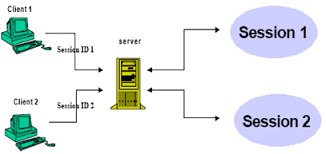
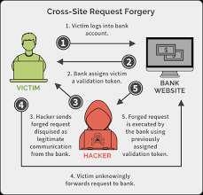
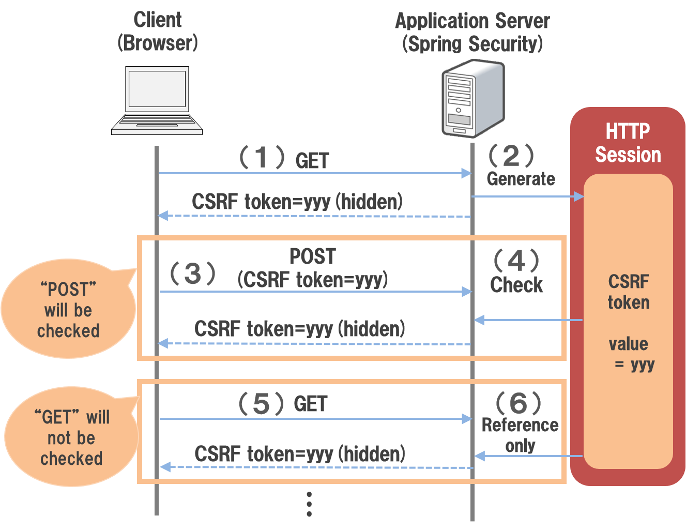
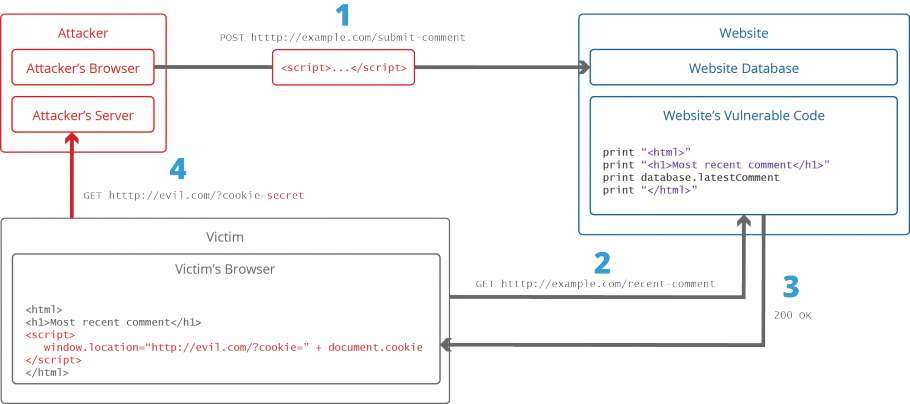
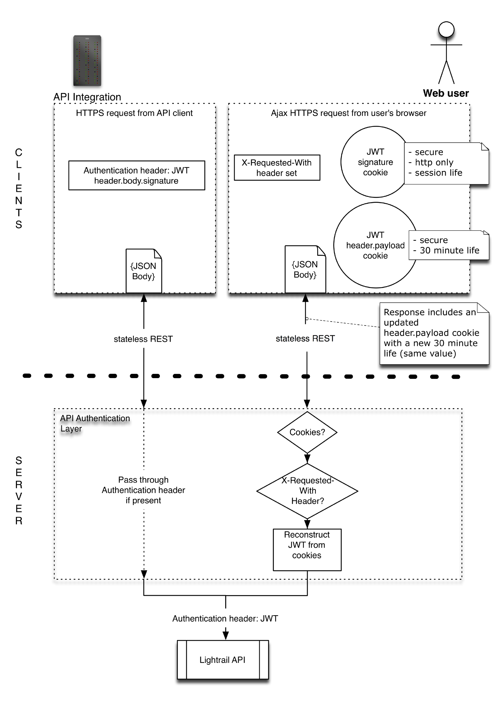

# Quick Introduce Laravel 
Laravel is framework php for web app. In 2022, 1,547,319 websites that are Laravel Customers. We know of 730,966 live websites using Laravel and an additional 816,353 sites that used Laravel applicable. Laravel is not high performance framework but it's one of the most popular web frameworks in the world. Laravel has the advantage of creating fast, full-featured code, which is a great source of keywords for web developers.

#  Introduce DissectLaravel doc
There's tons of laravel documentation all over the place, it floods every web page and every discussion. However, I did not find any document that is deep and extensive enough, the knowledge system of laravel. As you know, from a technical perspective, when you read the doc and use it, you partially understand it. But you really get insight when you read the source code, understand how it's implemented, how it's designed. The source code will provide and reflect the software as it is, pure and straightforward. This is the most in-depth and intuitive approach to opensource. Of course it is not easy and takes a lot of resources. When you understand the source code, you will learn a lot from that opensource, you will debug problems very quickly without finding answers or unclear. You have a systematic thinking about the product, able to solve and fix very difficult bugs. This document provides a general analysis of the theory, the keyword laravel implementation, it is the most general, it is true for web technology in general, regardless of the language. I will try to analyze the laravel source code on the mind of web technology these days. I believe it is a useful reference for web developers, as well as devops who want an overview of the web app system.

# Who need doc
This document is for anyone passionate about web app, passionate about php, laravel for all level. If you don't like php, approach it by keyword, but if you love php, enjoy and relax with it. Hope it brings value and helps someone improves level, or simply solve your problem.

# License
All copyrights of the material belong to me. You can read, use, share for many people but no commercial rights or anything related business about it. I want to share it for free to the community

# Contacts
gmail: minhnghia.pham.it@gmail.com

# Quick Look (HowTo):
- [Overview and layout sourcecode Laravel](https://github.com/Nghiait123456/DissectLaravel#LayoutLaravel)


# Table of Contents
- [How To Understand Big Project](#HowToUnderstandBigProject)
- [Preview Laravel Layout](#LayoutLaravel)
    - [Php and index.php ](#PhpAndIndexPhp)
    - [index.php in laravel ](#IndexPhpLaravel)
    - [Public folder in laravel ](#PublicFolderIndexPhpLaravel)
    - [When save file in public folder ](#WhenSaveFileInPublicFolder)
    - [How to dissect Laravel source](#HowToDisectLaravelSource)

- [Modul](#Modul)
  - [Session](#Session)
    - [Define session](#DefineSession)
    - [Session in current web app](#SessionInCurrentWebApp)
    - [Session default in php is not good](#DefaultSSPhpNotGood)
    - [Session in laravel](#SessionInLaravel)
    - [Preview session in laravel](#PreviewSessionInLaravel)
    - [Dissect session in laravel](#DissectSessionInLaravel)
      - [Concat session](#ConcatSession)
      - [Detail session](#DetailSession)
    - [Csrf](#Csrf)
      - [Csrf Security Define](#CsrfSecurityDefine)
      - [Prevention Csrf](#PreventionCsrf)
      - [Csrf Token Define](#CrsfTokenDefines)
      - [Why Don't Use Crsf For GET Method](#DontUseCsrfForGetMethod)
      - [Csrf Token Laravel](#CrsfTokenLaravel)
      - [Best practice Csrf Laravel](#BestPracticeCsrfLaravel)
    - [Xss](#Xss)
      - [Xss Security Define](#XssSecurityDefine)
      - [Prevention Xss](#PreventionXss)
      - [Best practice Xss](#BestPracticeXss)
      - [Where save token in browser](#WhereSaveToken)
        - [How to ajax,... work with Http only cookie](#AjaxHttpOnlyCookie)
        


## How To Understand Big Project <a name="HowToUnderstandBigProject"></a>
A large project always has a lot of lines of code, with laravel 7.X being around 400 000 lines of code. So how do you approach it? My approach is top down thinking, approach from layout code ==> autoload ==> module ==> detail. One question is do you need to know the entire line of code of an opensource to understand it? The answer is no. Any module or source has main components and options. The main component represents the main feature of the project. You only need to understand the whole main component, most of the options are based on the main component. That's how I and this document approach the Laravel source. I know that's the same way most programmers choose to approach a very large project.
## Preview Laravel Layout <a name="LayoutLaravel"></a> 
## Php And Index.php <a name="PhpAndIndexPhp"></a>
In any programming language, there is usually a startpoint to start a project. Print c, go, c++, it's main() function, print php, it's index.php

## Index.php in Laravel <a name="IndexPhpLaravel"></a>
The vesion I use is laravel 7.5, this is source framework https://github.com/laravel/framework/tree/7.x.
This is source index.php https://github.com/laravel/laravel/blob/7.x/public/index.php

Inline 24, you see code:
``` require __DIR__.'/../vendor/autoload.php';```

Print php, use compose control version. In line 24, laravel require autoload of project. Laravel will load all Class Loader, including Laravel core and third editor packet.


InLine 38:
``` 
$app = require_once __DIR__.'/../bootstrap/app.php';
``` 
Laravel mapping and building interface of laravel with application.


print line 52 to 60:

``` 
$kernel = $app->make(Illuminate\Contracts\Http\Kernel::class);

$response = $kernel->handle(
$request = Illuminate\Http\Request::capture()
);

$response->send();

$kernel->terminate($request, $response);
``` 

Laravel make one instance of Kernel Laravel, Laravel get incoming request from webserver, push to endpoint and response request. Laravel terminate index.php, and terminate the process handle request generated by the webserver


## Public folder in laravel <a name="PublicFolderIndexPhpLaravel"></a>
Why laravel has public folder? Why is index.php in there. Benefits and security of public folders. <br/>

Let's refer to a simple config of apache2 vs laravel:

``` 
<VirtualHost *:80>
ServerAdmin admin@test.com
ServerName test.com
DocumentRoot /home/anonymous/Desktop/Laravel/test/src/public

    <Directory/home/anonymous/Desktop/Laravel/test/src/public >
        Options -Indexes +FollowSymLinks +MultiViews
        AllowOverride All
        Require all granted
        <FilesMatch \.php$>
            # Change this "proxy:unix:/path/to/fpm.socket"
            # if using a Unix socket
            #SetHandler "proxy:fcgi://127.0.0.1:9000"
        </FilesMatch>
    </Directory>

    ErrorLog ${APACHE_LOG_DIR}/myapp.com-error.log

    # Possible values ​​include: debug, info, notice, warn, error, crit,
    # alert, emerg.
    LogLevel warn
    CustomLog ${APACHE_LOG_DIR}/myapp.com-access.log combined
``` 
First, Laravel creates a public folder to contain the system's public files or resources, SymLinks. +FollowSymLinks Config folder public allows webserver FollowSymLinks, "+MultiViews" : A MultiViews search is where the server does an implicit filename pattern match,and choose from amongst the results , “AllowOverride” which allows you to override some Apache settings via a . htaccess file you can place in a director. This config allows the webserver to do a lot of things with the public folder, it allows the webserver to access the files in the public folder and return it to the browser. Therefore, only files that are public will be placed in the public folder.

## When save file in public folder <a name="WhenSaveFileInPublicFolder"></a>
With the public file used for all users, you should save it in the public folder: css, js, images... </br>
The files are specific to the request or the specific session, not stored in the public folder. Let's imagine with user1, request 1 you create 1.txt file, you save that file in public folder. File 1.txt is created at server handle request 1, called server 1. at Request 2, user1 get 1.xlsl, but loadbalance is not forward to server1, but is forwarded to server2. Clearly, server2 don't have the file 1.txt, confused. For this problem, use the same remote server as S3, don't use Laravel's public folder


## How to disect Laravel source <a name="HowToDisectLaravelSource"></a>  
Laravel source code has many modules, many interfaces and many design patterns. Before reviewing the source, the first thing you need to do is determine which interface x is used by and for which class it is binding, like with Facade. There are many ways to detect this, view file autoload, use ide_helper support loading endpoint,... <br/>

the way me used in this doc is using file : https://github.com/laravel/framework/blob/7.x/src/Illuminate/Foundation/Application.php#L1234. It gives you all information about alias mapping interface and binding class when starting laravel app. That's the bare minimum of information you need to dissect Laravel.

## Modul <a name="Modul"></a>   
## Session <a name="Session"></a>

## Define session  <a name="DefineSession"></a>  


session = session_id + data mapping;  </br>

Simply put, a session is a memory area that is directly mapped to the user upon login. With any memory area, when using it, it is necessary to identify (session_id) and data (data mapping). sesson_id is unique.


## Session in current web app <a name="SessionInCurrentWebApp"></a>  
In the modern world of web apps, especially microservices, it is not necessary to need a memory area that holds all the data when the user logs in. Data in microservices directly depends on services and events, tending to be independent and staless. However, when there is a need and need to use, or use any model like session, apply this simple rule: session = session_id + data mapping; </br>

Session in web apps these days can use a lot of drivers, files, caches, DBs, cookies, etc. This is flexible and suitable for today's needs.

##  Session default in php is not good  <a name="DefaultSSPhpNotGood"></a> 
Session default in php not good enough? Exactly, it's not good enough for most web apps these days. Php auto generate session Id and save in cookie, drive of this default is file. There is almost no way to interfere with this process. This is obviously not good enough, use Laravel's session, it's a trend as most php frameworks are no longer using php's default session. Other frameworks Django, Flask, Gin, ... have different approaches to sessions but the basic idea is still the same general formula in the Session definition.

## Session in laravel <a name="SessionInLaravel"></a> 
## Preview session in laravel <a name="PreviewSessionInLaravel"></a>  
Laravel Session is built by Laravel itself, completely independent of default php session. It fully supports all popular drives: cache (redis/memcache, file, DB, cookie, ...). In a modern web application that needs high performance, I recommend drive cache(redis/memcache).

## Dissect session in laravel  <a name="DissectSessionInLaravel"></a>  
### Concat session <a name="ConcatSession"></a>   
Session has many drives, the main operations with memory are read and write, so it is easy to guess the main interface is read(), write(), getDefaultDriver() </br>

In line https://github.com/laravel/framework/blob/7.x/src/Illuminate/Support/Manager.php#L66 :
/**
* Get the default driver name.
*
* @return string
*/
abstract public function getDefaultDriver();

Session Manager extern Manager.php and it implements the function getDefaultDriver() to determine the driver configured in the system. </br>

Print file: https://github.com/laravel/framework/blob/7.x/src/Illuminate/Contracts/Session/Session.php. It saves all interfaces for session interaction, including push(), get().


### Detail session <a name="DetailSession"></a>  
``` 
/**
* Register the session manager instance.
*
* @return void
*/
protected function registerSessionManager()
{
  $this->app->singleton('session', function ($app) {
  return new SessionManager($app);
});
}
``` 
From snippet: https://github.com/laravel/framework/blob/7.x/src/Illuminate/Session/SessionServiceProvider.php#L34-L39. Laravel registers a SessionManager() instance representing the laravel session.
in SessionMager, Laravel implements abstract public function getDefaultDriver() using https://github.com/laravel/framework/blob/7.x/src/Illuminate/Session/SessionManager.php#L240-L243. It implements the interface and returns the instance of the session drive configured in the system. </br>

How to laravel implement all driver and wrap it in code. After getting instance for session config in system, Laravel pass instance to :
https://github.com/laravel/framework/blob/7.x/src/Illuminate/Session/Store.php#L57-L62
public function __construct($name, SessionHandlerInterface $handler, $id = null)
{
$this->setId($id);
$this->name = $name;
$this->handler = $handler;
}
The SessionHandlerInterface represents one of the drives that Laravel has. The rest of the functions of the Store.php class are a wrapper for the SessionHandlerInterface. </br>

+) In drive: https://github.com/laravel/framework/blob/7.x/src/Illuminate/Session/CacheBasedSessionHandler.php, it implements the most basic functions like get(), set(), distroy (). Session in laravel with any drive is saved to a session key, this operation is quite simple. </br>

===> to summarize there are two class blocks, code block 1 gets the instance drive configured, Code block 2 implements the functions of each drive, this is the main job of the Laravel session.

# Csrf <a name="Csrf"></a>
## Csrf Security Define <a name="CsrfSecurityDefine"></a>
  


Csrf is define clear in link: https://creativegroundtech.com/what-is-cross-site-request-forgery-csrf/. CSRF attacks explois the trust a Web application has in an authenticated user. </br>

In short, user after authen success, hacker trick user into interacting with a page, from, link, ... or anything form other web. After this action, hackers often submit a form to the web they want to attack. Because action form user authen, broswer forward cookie and data, then request is valid. Hackers look for loopholes to send requests that damage users and websites.

## Prevention Csrf <a name="PreventionCsrf"></a> 
Prevention Csrf:
Starting from the CSRF definition, i have prevention way:
+) Use Same Site Flag Cookie : cookie will only be sent from request originating from 1 domain, hacker attack but request reject beacause fail authen. </br>

+) Crsf Token: will explain in next part

+) Open mode check CORS : it's bad solution, why it changes very much business. It's just only good solution when web wants open check CORS(not for prevention CSRF, for business)


## Csrf Token Define <a name="CrsfTokenDefines"></a>


Detail process CRSF token in link: https://terasolunaorg.github.io/guideline/5.1.0.RELEASE/en/Security/CSRF.html </br>

I want to emphasize, the object of the csrf token is usually a post form. Why? It's the second protection mechanism after the authen websie for CSRF attack. </br>
Ideal is : we create token for submit form, when submit form, if token match, we access, if not match, we reject. If hacker pass authen form CSRF, hacker don't simple get CSRF token ==> hacker don't submit form ==> don't have any attacks.

## Why don't use Csrf for GET method <a name="DontUseCsrfForGetMethod"></a>
Why don't use CSRF for GET method: </br>
In define api, GET method return data, not change resouce, it's not risk of attacks. Of course, you can use the CSRF token for the Get method,so it's not necessary, always remember the theorem, security and complexity are usually proportional.


## Csrf Token Laravel <a name="CrsfTokenLaravel"></a>
Laravel keep ideal Crsf when implement.
How to create sessions?
view code: https://github.com/laravel/framework/blob/7.x/src/Illuminate/Session/Store.php#L64-L78 </br>

``` 
/**
* Start the session, reading the data from a handler.
*
* @return bool
  */
  public function start()
  {
  $this->loadSession();

         if (! $this->has('_token')) {
             $this->regenerateToken();
         }

         return $this->started = true;
  }

``` 
Laravel construct CSRF token when first time start session.
if (! $this->has('_token')) {
$this->regenerateToken();
} </br>

when one requets incoming sever, laravel check CSRF token ('_token' ) exits, if not exits, Laravel create new CSRF token.

View code:
https://github.com/laravel/framework/blob/7.x/src/Illuminate/Session/Store.php#L609-L617 <br>
``` 
    /**
     * Regenerate the CSRF token value.
     *
     * @return void
     */
    public function regenerateToken()
    {
        $this->put('_token', Str::random(40));
    } </br>
``` 
CSRF token in laravel create by randon str. It's simple way why token don't contain data insight. CSRF token only one task, check macth CRSF token with form submit.
+) How to Laravel save CSRF cookies?
View code :
https://github.com/laravel/framework/blob/7.x/src/Illuminate/Foundation/Http/Middleware/VerifyCsrfToken.php#L78-L82 </br>
``` 
    /**
     * Handle an incoming request.
     *
     * @param \Illuminate\Http\Request $request
     * @param \Closure $next
     * @return mixed
     *
     * @throws \Illuminate\Session\TokenMismatchException
     */
    public function handle($request, Closure $next)
    {
        if (
            $this->isReading($request) ||
            $this->runningUnitTests() ||
            $this->inExceptArray($request) ||
            $this->tokensMatch($request)
        ) {
            return tap($next($request), function ($response) use ($request) {
                if ($this->shouldAddXsrfTokenCookie()) {
                    $this->addCookieToResponse($request, $response);
                }
            });
        }

        throw new TokenMismatchException('CSRF token mismatch.');
    }
``` 
For every incoming request, Laravel check exit XSRF cookie, if not exits, Laravel create it.

+) How to Laravel verify CSRF token?
view code: https://github.com/laravel/framework/blob/7.x/src/Illuminate/Foundation/Http/Middleware/VerifyCsrfToken.php#L130-L143 </br>
``` 
/**
* Determine if the session and input CSRF tokens match.
*
* @param \Illuminate\Http\Request $request
* @return bool
*/
protected function tokensMatch($request)
{
$token = $this->getTokenFromRequest($request);

        return is_string($request->session()->token()) &&
               is_string($token) &&
               hash_equals($request->session()->token(), $token);
    } </br>
``` 
print code : https://github.com/laravel/framework/blob/7.x/src/Illuminate/Foundation/Http/Middleware/VerifyCsrfToken.php#L72-L77, have many rule verify CSRF, but main rule, it is before. </br>
Simple way, Laravel just checks CSRF in session and CSRF in cookie(XSRF) is matching, hash_equals($request->session()->token(), $token).
```
===> From Laravel source, you learned one rule for timing attack. When you compare token, don't use ===, please you hash_compare or function same in other language.</br>
===> Well done, you clearly how to Laravel implement CSRF token.
You have skill debug of hard bug related to CSRF, 419 page expiry. Have CSRF bug is difficult to find context, but if you clearly core Laravel CSRF, you ready debug all.
```

## Xss <a name="Xss"></a>
## Xss Security Define] <a name="XssSecurityDefine"></a>



1) The attacker injects a payload into the website’s database by submitting a vulnerable form with malicious JavaScript content. </br>
2) The victim requests the web page from the web server. </br>
3) The web server serves the victim’s browser the page with attacker’s payload as part of the HTML body. </br>
4) The victim’s browser executes the malicious script contained in the HTML body. In this case, it sends the victim’s cookie to the attacker’s server.
5) The attacker now simply needs to extract the victim’s cookie when the HTTP request arrives at the server. </br>
6) The attacker can now use the victim’s stolen cookie for impersonation. </br>

```
In short, Xss attack from the trust a use has in a particular Web application.
```


## Prevention Xss <a name="PreventionXss"></a>
How to Prevent Xss: </br>
+) Filter resource Xss </br>
+) Http Cookies only </br>
+) SameSite Origin Cookies </br>
+) Open mode check CORS in backend(not good solution) </br>

## Best practice Xss <a name="BestPracticeXss"></a> 
In my way, best practice prevent Xss:
+) Actively filter data Xss after save
+) Http Only cookies, Http Same Site Origin cookies


## Where save token in browser <a name="WhereSaveToken"></a> 
Where to save tokens in browser? This is classic Q/A? </br>
There are countless answers and countless approaches. For me when approaching in the direction of security and performance, it my way: </br>
+) token always save in cookie with http only, security, same site,... </br>
==> it is the best way for security, leading security organizations advise to do it. </br>

But, In Mode Http only, js don't get cookies. So, how to call ajax, ... or same tool to request to server. Please check next part. </br>

## How to ajax,... work with Http only cookie <a name="AjaxHttpOnlyCookie"></a> 
This is problem: token (jwt token) default don't verify from cookie. Token is stateless, in app or end point, it is usually passed to header. But in broswer, in part: #WhereSaveToken, i suggest token should be stored http only cookie. </br>

How to pass jwt verify when js don't get cookies in http only mode? </br>

I find many solutions in internet, but most of them are not good enough or too complicated, too risky. The most commonly found solutiton was: XMLHTTPresponse headers are giving the cookie. It's very bad ideal. </br>

Luckily, I find solution match with my solution, it's simples way but don't have risk, don't have down performance: </br>
https://medium.com/lightrail/getting-token-authentication-right-in-a-stateless-single-page-application-57d0c6474e3 </br>



```
Simple way, leave that to the backend. All you need to do is create a middleware, middleware job is to check exist jwt in header, if not exits, it's auto copy jwt from cookie to header. If done, it's return and allow next handle. </br>
This solution work for all browser and all tool call api. Great !!!
```
