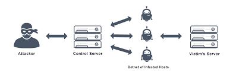
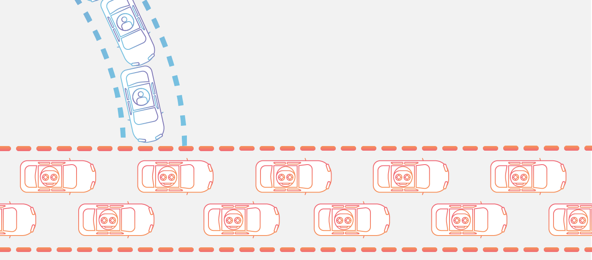

# Quick Introduce Laravel

Laravel is framework php for web app. In 2022, 1,547,319 websites that are Laravel Customers. We know of 730,966 live
websites using Laravel and an additional 816,353 sites that used Laravel applicable. Laravel is not high performance
framework but it's one of the most popular web frameworks in the world. Laravel has the advantage of creating fast,
full-featured code, which is a great source of keywords for web developers.

# Introduce DissectLaravel doc

There's tons of laravel documentation all over the place, it floods every web page and every discussion. However, I did
not find any document that is deep and extensive enough, the knowledge system of laravel. As you know, from a technical
perspective, when you read the doc and use it, you partially understand it. But you really get insight when you read the
source code, understand how it's implemented, how it's designed. The source code will provide and reflect the software
as it is, pure and straightforward. This is the most in-depth and intuitive approach to opensource. Of course it is not
easy and takes a lot of resources. When you understand the source code, you will learn a lot from that opensource, you
will debug problems very quickly without finding answers or unclear. You have a systematic thinking about the product,
able to solve and fix very difficult bugs. This document provides a general analysis of the theory, the keyword laravel
implementation, it is the most general, it is true for web technology in general, regardless of the language. I will try
to analyze the laravel source code on the mind of web technology these days. I believe it is a useful reference for web
developers, as well as devops who want an overview of the web app system. </br>

The issues I'm covering in this document are not just for Laravel but for web app technology in general. All issues will
be presented from theory to core source code and to practice.

# Who need doc

This document is for anyone passionate about web app, passionate about php, laravel for all level. If you don't like
php, approach it by keyword, but if you love php, enjoy and relax with it. Hope it brings value and helps someone
improves level, or simply solve your problem.

# License

All copyrights of the material belong to me. You can read, use, share for many people but no commercial rights or
anything related business about it. I want to share it for free to the community

# Contacts

gmail: minhnghia.pham.it@gmail.com

# Quick view and highlight:

(If you want to go fast, use the quick view menu, it has highlight meny. But I recommend learning in order, the
components I talk about are logically related to each other. Read in order you will have a system. more clear. However,
how you read is up to your preference. Here we go)

- [How To Understand Big Project](#how_to_understand_big_project)
- [When save file in public folder ](./modules/layout.md#when_save_file_in_public_folder)
- [How to dissect Laravel source](#how_to_disect_laravel_source)
- [Dissect session in laravel](./modules/session.md#dissect_session_in_laravel)
- [Best practice Xss](./modules/session.md#best_practice_xss)
- [Why are there many type token, accessToken, refreshToken, What is their main purpose?](./modules/session.md#what_is_their_main_purpose_many_type_token)
- [Where save token in browser, what is best practice?](./modules/session.md#where_save_token)
- [How do ajax,... work with Http only cookie?](./modules/session.md#ajax_http_only_cookie)
- [Why framework frontend often use local store for save token?](./modules/session.md#why_framework_front_end_oftern_user_local_store_for_save_token)
- [Preview type Http server](./modules/http-routing.md./modules/http-routing.md#preview_type_http_server)
- [Why  are there so many webserver models?](./modules/http-routing.md#why_are_there_so_many_webserver_models?)
- [Why is the webServer model constantly changing?](./modules/http-routing.md#why_is_the_web_server_model_constantly_changing?)
- [What is trending in Http server?](./modules/http-routing.md#what_is_trending_in_http_server)
- [Type http server in Php and Laravel](./modules/http-routing.md##type_http_server_in_php_and_laravel)
- [Preview contracts in http modules](./modules/http-routing.md#preview_contracts_in_http_modules)
- [Dissect http and routing modules](./modules/http-routing.md#dissect_http_and_routing_modules)
- [Best practice when use driver cache?](./modules/cache.md./modules/cache.md#best_practice_when_use_driver_cache)
- [Contracts cache](./modules/cache.md#contracts_cache)
- [Dissect cache](./modules/cache.md#dissect_cache)
- [What is muxtex lock?](./modules/cache.md#what_is_muxtex_lock)
- [How is mutex lock implement for many driver in Laravel?](./modules/cache.md#how_is_mutex_lock_implement_for_many_driver_in_laravel)
- [Dissect mutex lock in redis](./modules/cache.md#dissect_mutex_lock_in_redis)
- [How to algorithm of redis implement mutex lock?](./modules/cache.md#how_to_redis_implement_mutex_lock)
- [What is distribute lock?](./modules/cache.md#what_is_distribute_lock)
- [What is redlock?](#./modules/cache.md#what_is_redlock)
- [How to Laravel implement theory of Redis?](./modules/cache.md#how_to_laravel_implement_theory_of_redis)
- [What is local in memory?](./modules/cache.md#what_is_local_in_memory)
- [What is type of local in memory?](./modules/cache.md#what_is_typef_local_in_memory)
- [When is use local in memory?](./modules/cache.md#when_is_use_local_in_memory?)
- [Implement local in memory with Laravel?](./modules/cache.md#implement_local_in_memory_with_laravel)
- [Advantages and disadvantages of local in memory with Laravel?](./modules/cache.md#advantages_and_disadvantages_of_local_in_memory_with_laravel)
- [What is algorithm rate limit?](#what_is_algorithm_rate_limit)
- [Dissect Rate Limit Laravel](#dissect_rate_limit_laravel)
- [What is ddos?](#what_is-ddos)
- [Why do not use Rate limit laravel for attack ddos?](#why_do_not_use_rate_limit_laravel_for_attack_ddos)
- [Best practice prevent attack ddos](./modules/best-pratice.md./modules/best-pratice.md#best_practice_prevent_attack_ddos)
- [Best practice in flash sales?](./modules/best-pratice.md#best_practice_in_flash_sales)
- [To do](#todo)

# Table of Contents

- [How To Understand Big Project](#how_to_understand_big_project)
- [Preview Laravel Layout](#layout_laravel)
    - [Php and index.php ](#php_and_index_php)
    - [index.php in laravel ](#index_php_laravel)
    - [Public folder in laravel ](#public_folder_index_php_laravel)
    - [When save file in public folder ](#when_save_file_in_public_folder)
    - [How to dissect Laravel source](#how_to_disect_laravel_source)

- [Modules](#modul)
    - [Session](./modules/session.md#session)
        - [Define session](./modules/session.md#define_session)
        - [Session in current web app](./modules/session.md#session_in_current_web_app)
        - [Session default in php is not good](./modules/session.md#default_ss_php_not_good)
        - [Session in laravel](./modules/session.md#session_in_laravel)
        - [Preview session in laravel](./modules/session.md#preview_session_in_laravel)
        - [Dissect session in laravel](./modules/session.md#dissect_session_in_laravel)
            - [Concat session](./modules/session.md#concat_session)
            - [Detail session](./modules/session.md#detail_session)
        - [Csrf](./modules/session.md#csrf)
            - [Csrf Security Define](./modules/session.md#csrf_security_define)
            - [Prevention Csrf](./modules/session.md#prevention_csrf)
            - [Csrf Token Define](./modules/session.md#crsf_token_defines)
            - [Why Don't Use Crsf For GET Method](./modules/session.md#dont_use_csrf_for_get_method)
            - [Csrf Token Laravel](./modules/session.md#crsf_token_laravel)
        - [Xss](./modules/session.md#xss)
            - [Xss Security Define](./modules/session.md#xss_security_define)
            - [Prevention Xss](./modules/session.md#prevention_xss)
            - [Best practice Xss](./modules/session.md#best_practice_xss)
            - [Why are there many type token, accessToken, refreshToken, What is their main purpose?](./modules/session.md#what_is_their_main_purpose_many_type_token)
            - [Where save token in browser, what is best practice?](./modules/session.md#where_save_token)
                - [How do ajax,... work with Http only cookie?](./modules/session.md#ajax_http_only_cookie)
                - [Why framework frontend often use local store for save token?](./modules/session.md#why_framework_front_end_oftern_user_local_store_for_save_token)

    - [Http and Routing](./modules/http-routing.md#http_and_routing)
        - [Preview type Http server](./modules/http-routing.md#preview_type_http_server)
        - [Why  are there so many webserver models?](./modules/http-routing.md#why_are_there_so_many_webserver_models?)
        - [Why is the webServer model constantly changing?](./modules/http-routing.md#why_is_the_web_server_model_constantly_changing?)
        - [What is trending in Http server?](./modules/http-routing.md#what_is_trending_in_http_server)
        - [Type http server in Php and Laravel](#type_http_server_in_php_and_laravel)
        - [Preview contracts in http modules](./modules/http-routing.md#preview_contracts_in_http_modules)
        - [Dissect http and routing modules](./modules/http-routing.md#dissect_http_and_routing_modules)
            - [How to register one router work?](./modules/http-routing.md#how_to_register_one_router_work?)
            - [How to mapping request to server with router?](./modules/http-routing.md#how_to_mapping_request_to_server_with_route?)
            - [Laravel handle all request with one endpoint](./modules/http-routing.md#laravel_handle_all_request_with_one_endpoint)

    - [Cache](./modules/cache.md#cache)
        - [What is cache?](./modules/cache.md#what_is_cache)
        - [What is cache importance in webapp?](./modules/cache.md#why_is_cache_importance_in_web_app)
        - [What is cache in Laravel?](./modules/cache.md#what_is_cache_in_laravel)
        - [What is type of cache in Laravel?](./modules/cache.md#what_is_type_of_cache_in_laravel)
        - [Best practice when use driver cache?](./modules/cache.md#best_practice_when_use_driver_cache)
        - [Contracts cache](./modules/cache.md#contracts_cache)
        - [Dissect cache](./modules/cache.md#dissect_cache)
            - [How to Repository cache in Laravel work?](./modules/cache.md#how_to_repository_cache_in_laravel_work)
                - [How is Laravel get value of one key?](./modules/cache.md#how_is_laravel_get_value_of_one_key)
                - [How is Laravel push value to one key?](./modules/cache.md#how_is_laravel_push_value_to_one_key)
            - [How to Laravel implement one instance cache?](./modules/cache.md#how_to_laravel_implement_one_instance_cache)
            - [How to Laravel implement one endpoint call Cache from CacheManager?](./modules/cache.md#how_to_laravel_implement_one_endpoint_call_cache_from_cache_manager)
                - [How to Facades Cache bind and what bind?](./modules/cache.md#how_to_facades_cache_bind_and_what_bind)
                - [How to CacheManager mapping to one driver cache?](./modules/cache.md#how_to_cache_manager_mapping_to_one_driver_cache)
                - [Call static auto mapping in CacheManager?](./modules/cache.md#call_static_auto_mapping_in_cache_manager)

        - [What is muxtex lock?](./modules/cache.md#what_is_muxtex_lock)
        - [How is mutex lock implement for many driver in Laravel?](./modules/cache.md#how_is_mutex_lock_implement_for_many_driver_in_laravel)
        - [Dissect mutex lock in redis](./modules/cache.md#dissect_mutex_lock_in_redis)
            - [How to algorithm of redis implement mutex lock?](./modules/cache.md#how_to_redis_implement_mutex_lock)
            - [What is distribute lock?](./modules/cache.md#what_is_distribute_lock)
            - [What is redlock?](#./modules/cache.md#what_is_redlock)
            - [How to Laravel implement theory of Redis?](./modules/cache.md#how_to_laravel_implement_theory_of_redis)
                - [How to Laravel implement set mutex from Lua scripts?](./modules/cache.md#how_to_laravel_implement_set_lua_scripts)
                - [How to Laravel implement release mutex form Lua scripts?](./modules/cache.md#how_to_laravel_implement_set_lua_scripts)
            - [Advantages and disadvantages of mutex lock redis?](./modules/cache.md#advantages_and_disadvantages_of_mutex_lock_redis?)

        - [What is local in memory?](./modules/cache.md#what_is_local_in_memory)
        - [What is type of local in memory?](./modules/cache.md#what_is_type_of_local_in_memory)
        - [When is use local in memory?](./modules/cache.md#when_is_use_local_in_memory?)
        - [Implement local in memory with Laravel?](./modules/cache.md#implement_local_in_memory_with_laravel)
        - [Advantages and disadvantages of local in memory with Laravel?](./modules/cache.md#advantages_and_disadvantages_of_local_in_memory_with_laravel)
        - [What is algorithm rate limit?](./modules/cache.md#what_is_algorithm_rate_limit)
        - [Dissect Rate Limit Laravel](./modules/cache.md#dissect_rate_limit_laravel)
        - [What is ddos?](./modules/cache.md#what_is_ddos)
        - [Why do not use Rate limit laravel for attack ddos?](./modules/cache.md#why_do_not_use_rate_limit_laravel_for_attack_ddos)
        - [Best practice prevent attack ddos](./modules/best-pratice.md#best_practice_prevent_attack_ddos)
        - [Best practice in flash sales?](./modules/best-pratice.md#best_practice_in_flash_sales)
    - [To do](#todo)

## How To Understand Big Project <a name="how_to_understand_big_project"></a>

A large project always has a lot of lines of code, with laravel 7.X being around 400 000 lines of code. So how do you
approach it? My approach is top down thinking, approach from layout code ==> autoload ==> module ==> detail. One
question is do you need to know the entire line of code of an opensource to understand it? The answer is no. Any module
or source has main components and options. The main component represents the main feature of the project. You only need
to understand the whole main component, most of the options are based on the main component. That's how I and this
document approach the Laravel source. I know that's the same way most programmers choose to approach a very large
project.


## How to disect Laravel source <a name="how_to_disect_laravel_source"></a>

Laravel source code has many modules, many interfaces and many design patterns. Before reviewing the source, the first
thing you need to do is determine which interface x is used by and for which class it is binding, like with Facade.
There are many ways to detect this, view file autoload, use ide_helper support loading endpoint,... <br/>

the way me used in this doc is using
file : https://github.com/laravel/framework/blob/7.x/src/Illuminate/Foundation/Application.php#L1234. It gives you all
information about alias mapping interface and binding class when starting laravel app. That's the bare minimum of
information you need to dissect Laravel.

# What is algorithm rate limit? <a name="what_is_algorithm_rate_limit"></a>


Simply, rate limit is a counter that helps to check the limit of a resource (request, query, ...). For each request to
count, it increments the counter by 1 and checks with limited config.

# Dissect Rate Limit Laravel <a name="dissect_rate_limit_laravel"></a>

print https://github.com/laravel/framework/blob/9.x/src/Illuminate/Cache/RateLimiter.php:

```
   /**
     * Handle an incoming request.
     *
     * @param \Illuminate\Http\Request $request
     * @param \Closure $next
     * @param int|string $maxAttempts
     * @param float|int $decayMinutes
     * @param string $prefix
     * @return \Symfony\Component\HttpFoundation\Response
     *
     * @throws \Illuminate\Http\Exceptions\ThrottleRequestsException
     */
    public function handle($request, Closure $next, $maxAttempts = 60, $decayMinutes = 1, $prefix = '')
    {
        $key = $prefix.$this->resolveRequestSignature($request);

        $maxAttempts = $this->resolveMaxAttempts($request, $maxAttempts);

        if ($this->limiter->tooManyAttempts($key, $maxAttempts)) {
            throw $this->buildException($key, $maxAttempts);
        }

        $this->limiter->hit($key, $decayMinutes * 60);

        $response = $next($request);

        return $this->addHeaders(
            $response, $maxAttempts,
            $this->calculateRemainingAttempts($key, $maxAttempts)
        );
    }


    /**
     * Resolve the number of attempts if the user is authenticated or not.
     *
     * @param \Illuminate\Http\Request $request
     * @param int|string $maxAttempts
     * @return int
     */
    protected function resolveMaxAttempts($request, $maxAttempts)
    {
        if (Str::contains($maxAttempts, '|')) {
            $maxAttempts = explode('|', $maxAttempts, 2)[$request->user() ? ten];
        }

        if (! is_numeric($maxAttempts) && $request->user()) {
            $maxAttempts = $request->user()->{$maxAttempts};
        }

        return (int) $maxAttempts;
    }


 /**
     * Determine if the given key has been "accessed" too many times.
     *
     * @param string $key
     * @param int $maxAttempts
     * @return bool
     */
    public function tooManyAttempts($key, $maxAttempts)
    {
        if ($this->attempts($key) >= $maxAttempts) {
            if ($this->cache->has($key.':timer')) {
                return true;
            }

            $this->resetAttempts($key);
        }

        return false;
    }

    /**
     * Increment the counter for a given key for a given decay time.
     *
     * @param string $key
     * @param int $decaySeconds
     * @return int
     */
    public function hit($key, $decaySeconds = 60)
    {
        $this->cache->add(
            $key.':timer', $this->availableAt($decaySeconds), $decaySeconds
        );

        $added = $this->cache->add($key, 0, $decaySeconds);

        $hits = (int) $this->cache->increment($key);

        if (! $added && $hits == 1) {
            $this->cache->put($key, 1, $decaySeconds);
        }

        return $hits;
    }
```

For routers that implement a middeware rate limit, Laravel will implement a handle rate. RateLimiter is the main class,
$this->cache is the corresponding drive cache passed by Laravel according to config. For each request, Laravel
initializes the corresponding limit variable if it does not exist, and increments the counter variable by 1:

```
  $added = $this->cache->add($key, 0, $decaySeconds);
```

Laravel stores the timer interval as a flag marking the cache overate for the correct time interval. Laravel uses cache
to control this, if this flag is still there then that rateLimit is still valid, this flag is cleared due to invalidate
cache then rateLimit will also be reset:

```
  $this->cache->add(
            $key.':timer', $this->availableAt($decaySeconds), $decaySeconds
        );
```

Laravel update again on the first increment of value:

```
  if (! $added && $hits == 1) {
            $this->cache->put($key, 1, $decaySeconds);
        }
```

If the over limit condition is satisfied within the configed period, Laravel will catch it:

```
    public function tooManyAttempts($key, $maxAttempts)
    {
        if ($this->attempts($key) >= $maxAttempts) {
            if ($this->cache->has($key.':timer')) {
                return true;
            }

            $this->resetAttempts($key);
        }

        return false;
    }
```

Laravel throws ex and blocks the request stream:

```
 if ($this->limiter->tooManyAttempts($key, $maxAttempts)) {
            throw $this->buildException($key, $maxAttempts);
        }
```

Everything ends when the config time is over, the variables reset to the original process và tiếp tục chạy từ start
point.

# What is ddos? <a name="what_is_ddos"></a>



Ddos is a form of denial of service attack. Attackers often use large amounts of resources, proxies and technologies
that constantly change ip requests. It simply creates a very large request threshold that overloads the system's
responsiveness causing the system to lose control and down.

# Why do not use Rate limit laravel for attack ddos? <a name="why_do_not_use_rate_limit_laravel_for_attack_ddos"></a>


Let's analyze some Laravel rate limit features. Activity flow goes to the server, goes to the cache, updates the
resulting config. With this feature, when being attacked by ddos, the attacker's requests still go into the server, go
to the cache, handle and then be returned. This is very bad with ddos. Well, very quickly, bandwith or service backend
or cache service, or all three, or extra services will be overloaded. Which one goes first depends on your project's
context, but the project will definitely suffer. Remember one thing, never use larave ratelimit attack ddo. This is true
for all technologies and languages, not just php. Remember not to let things go too far. Good luck.

# To do? <a name="todo"></a>

I have dissect the most important and essential modules of Laravel. It is the module that any frame has required. But
right now, I don't have enough time and resources to maintain this project. If you have a need to contribute or want me
to dissect any more modules, please contribute or suggest me. When I have more time, I will come back to it. </br>

## Contributors
- [@NghiaIT](https://github.com/Nghiait123456)
- [@LeoTrinh](https://github.com/leotrinh)