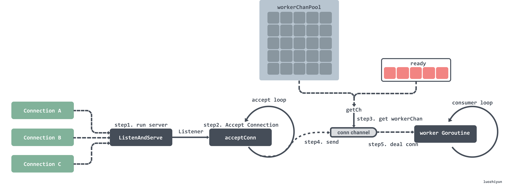

# Quick Introduce Laravel 
Laravel is framework php for web app. In 2022, 1,547,319 websites that are Laravel Customers. We know of 730,966 live websites using Laravel and an additional 816,353 sites that used Laravel applicable. Laravel is not high performance framework but it's one of the most popular web frameworks in the world. Laravel has the advantage of creating fast, full-featured code, which is a great source of keywords for web developers.

#  Introduce DissectLaravel doc
There's tons of laravel documentation all over the place, it floods every web page and every discussion. However, I did not find any document that is deep and extensive enough, the knowledge system of laravel. As you know, from a technical perspective, when you read the doc and use it, you partially understand it. But you really get insight when you read the source code, understand how it's implemented, how it's designed. The source code will provide and reflect the software as it is, pure and straightforward. This is the most in-depth and intuitive approach to opensource. Of course it is not easy and takes a lot of resources. When you understand the source code, you will learn a lot from that opensource, you will debug problems very quickly without finding answers or unclear. You have a systematic thinking about the product, able to solve and fix very difficult bugs. This document provides a general analysis of the theory, the keyword laravel implementation, it is the most general, it is true for web technology in general, regardless of the language. I will try to analyze the laravel source code on the mind of web technology these days. I believe it is a useful reference for web developers, as well as devops who want an overview of the web app system. </br>

The issues I'm covering in this document are not just for Laravel but for web app technology in general. All issues will be presented from theory to core source code and to practice.
# Who need doc
This document is for anyone passionate about web app, passionate about php, laravel for all level. If you don't like php, approach it by keyword, but if you love php, enjoy and relax with it. Hope it brings value and helps someone improves level, or simply solve your problem.

# License
All copyrights of the material belong to me. You can read, use, share for many people but no commercial rights or anything related business about it. I want to share it for free to the community

# Contacts
gmail: minhnghia.pham.it@gmail.com

# Quick Look (HowTo):
- [Overview and layout sourcecode Laravel](https://github.com/Nghiait123456/DissectLaravel#LayoutLaravel)


# Table of Contents
- [How To Understand Big Project](#HowToUnderstandBigProject)
- [Preview Laravel Layout](#LayoutLaravel)
    - [Php and index.php ](#PhpAndIndexPhp)
    - [index.php in laravel ](#IndexPhpLaravel)
    - [Public folder in laravel ](#PublicFolderIndexPhpLaravel)
    - [When save file in public folder ](#WhenSaveFileInPublicFolder)
    - [How to dissect Laravel source](#HowToDisectLaravelSource)

- [Modules](#Modul)
  - [Session](#Session)
    - [Define session](#DefineSession)
    - [Session in current web app](#SessionInCurrentWebApp)
    - [Session default in php is not good](#DefaultSSPhpNotGood)
    - [Session in laravel](#SessionInLaravel)
    - [Preview session in laravel](#PreviewSessionInLaravel)
    - [Dissect session in laravel](#DissectSessionInLaravel)
      - [Concat session](#ConcatSession)
      - [Detail session](#DetailSession)
    - [Csrf](#Csrf)
      - [Csrf Security Define](#CsrfSecurityDefine)
      - [Prevention Csrf](#PreventionCsrf)
      - [Csrf Token Define](#CrsfTokenDefines)
      - [Why Don't Use Crsf For GET Method](#DontUseCsrfForGetMethod)
      - [Csrf Token Laravel](#CrsfTokenLaravel)
      - [Best practice Csrf Laravel](#BestPracticeCsrfLaravel)
    - [Xss](#Xss)
      - [Xss Security Define](#XssSecurityDefine)
      - [Prevention Xss](#PreventionXss)
      - [Best practice Xss](#BestPracticeXss)
      - [Why are there many type token, accessToken, refreshToken, What is their main purpose?](#WhatIsTheirMainPurposeManyTypeToken)
      - [Where save token in browser, what is best practice?](#WhereSaveToken)
        - [How do ajax,... work with Http only cookie?](#AjaxHttpOnlyCookie)
        - [Why framework frontend often use local store for save token?](#WhyFrameworkFrontEndOfternUserLocalStoreForSaveToken)

  - [Http and Routing](#HttpAndRouting)
    - [Preview type Http server](#PreviewTypeHttpServer)
    - [Why  are there so many webserver models?](#WhyAreThereSoManyWebserverModels?)
    - [Why is the webServer model constantly changing?](#WhyIsTheWebServerModelConstantlyChanging?)
    - [What is trending in Http server?](#WhatIsTrendingInHttpServer?)
    - [Type http server in Php and Laravel](#TypeHttpServerInPhpAndLaravel)
    - [Preview contracts in http modules](#PreviewContractsInHttpModules)
    - [Dissect http and routing modules](#DissectHttpAndRoutingModules)
      - [How to register one router work?](#HowToRegisterOneRouterWork?)
      - [How to mapping request to server with router?](#HowToMappingRequestToServerWithRoute?)
      - [Laravel handle all request with one endpoint](#LaravelHandleAllRequestWithOneEndpoint)

  - [Cache](#Cache)
    - [What is cache?](#WhatIsCache)
    - [What is cache importance in webapp?](#WhyIsCacheImportanceInWebapp)
    - [What is cache in Laravel?](#WhatIsCacheInLaravel)
    - [What is type of cache in Laravel?](#WhatIsTypeOfCacheInLaravel)
    - [Contracts cache](#ContractsCache)
    - [Dissect cache](#DissectCache)
      - [How to Repository cache in Laravel work?](#HowToRepositoryCacheInLaravelWork)
      - [How to Laravel implement one instance cache?](#HowToLaravelImplementOneInstanceCache)
      - [How to Laravel Redis driver convert to Lua script?](#HowToLaravelRedisDriverConvertToLuascript)
      - [How to Laravel implement one endpoint call Cache from CacheManager?](#HowToLaravelImplementOneEndpointCallCacheFromCacheManager)
        - [How to Facades Cache bind and what bind?](#HowToFacadesCacheBindAndWhatBind)
        - [How to CacheManager mapping to one driver cache?](#HowToCacheManagerMappingToOneDriverCache)
        - [Call static auto mapping in CacheManager?](#CallStaticAutoMappingInCacheManager)
      - [Best practice when use driver cache?](#BestPracticeWhenUseDriverCache)
      - [What is muxtex lock?](#WhatIsMuxtexLock)
      - [How is mutex lock implement for many driver in Laravel ?](#HowIsMutexLockImplementForManyDriverInLaravel)
    - [Dissect mutex lock in redis](#DissectMutexLockInRedis)
      - [Dissect mutex lock in redis](#DissectMutexLockInRedis)
      - [How to algorithm of redis implement mutext lock?](#HowToRedisImplementMutexLock)
      - [How to Laravel implement theory of Redis?](#HowToLaravelImplementTheoryOfRedis)
        - [How to Laravel implement set mutex from Lua scripts?](#HowToLaravelImplementSetLuaScripts)
        - [How to Laravel implement release mutex form Lua scripts?](#HowToLaravelImplementSetLuaScripts)
      - [Advantages and disadvantages of mutex lock redis?](#AdvantagesAndDisadvantagesOfMutexLockRedis?)
      - [Best practice of mutex lock redis](#BestPractiveOfMutexLockRedis)

      - [What is local in memory?](#WhatIsLocalInMemory)
      - [Implement local in memory with Laravel?](#ImplementLocalInMemoryWithLaravel)
      - [Advantages and disadvantages of local in memory with Laravel?](#AdvantagesAndDisadvantagesOfLocalInMemoryWithLaravel)
      - [Best practice  of local in memory with Laravel](#BestPracticeOfLocalInMemoryWithLaravel)
    - [What is algorithm rate limit?](#WhatIsAlgorithmRateLimit)
    - [Dissect Rate Limit Laravel](#Dissect Rate limit Laravel)
    - [Why do not use Rate limit laravel for attack ddos?](#WhyDoNotUseRateLimitLaravelForAttackDdos)
    - [Best practice attack ddos ](#BestPracticeAttackDdos)
      


## How To Understand Big Project <a name="HowToUnderstandBigProject"></a>
A large project always has a lot of lines of code, with laravel 7.X being around 400 000 lines of code. So how do you approach it? My approach is top down thinking, approach from layout code ==> autoload ==> module ==> detail. One question is do you need to know the entire line of code of an opensource to understand it? The answer is no. Any module or source has main components and options. The main component represents the main feature of the project. You only need to understand the whole main component, most of the options are based on the main component. That's how I and this document approach the Laravel source. I know that's the same way most programmers choose to approach a very large project.
## Preview Laravel Layout <a name="LayoutLaravel"></a> 
## Php And Index.php <a name="PhpAndIndexPhp"></a>
In any programming language, there is usually a startpoint to start a project. Print c, go, c++, it's main() function, print php, it's index.php

## Index.php in Laravel <a name="IndexPhpLaravel"></a>
The vesion I use is laravel 7.5, this is source framework https://github.com/laravel/framework/tree/7.x.
This is source index.php https://github.com/laravel/laravel/blob/7.x/public/index.php

Inline 24, you see code:
``` require __DIR__.'/../vendor/autoload.php';```

Print php, use compose control version. In line 24, laravel require autoload of project. Laravel will load all Class Loader, including Laravel core and third editor packet.


InLine 38:
``` 
$app = require_once __DIR__.'/../bootstrap/app.php';
``` 
Laravel mapping and building interface of laravel with application.


print line 52 to 60:

``` 
$kernel = $app->make(Illuminate\Contracts\Http\Kernel::class);

$response = $kernel->handle(
$request = Illuminate\Http\Request::capture()
);

$response->send();

$kernel->terminate($request, $response);
``` 

Laravel make one instance of Kernel Laravel, Laravel get incoming request from webserver, push to endpoint and response request. Laravel terminate index.php, and terminate the process handle request generated by the webserver


## Public folder in laravel <a name="PublicFolderIndexPhpLaravel"></a>
Why laravel has public folder? Why is index.php in there. Benefits and security of public folders. <br/>

Let's refer to a simple config of apache2 vs laravel:

``` 
<VirtualHost *:80>
ServerAdmin admin@test.com
ServerName test.com
DocumentRoot /home/anonymous/Desktop/Laravel/test/src/public

    <Directory/home/anonymous/Desktop/Laravel/test/src/public >
        Options -Indexes +FollowSymLinks +MultiViews
        AllowOverride All
        Require all granted
        <FilesMatch \.php$>
            # Change this "proxy:unix:/path/to/fpm.socket"
            # if using a Unix socket
            #SetHandler "proxy:fcgi://127.0.0.1:9000"
        </FilesMatch>
    </Directory>

    ErrorLog ${APACHE_LOG_DIR}/myapp.com-error.log

    # Possible values ​​include: debug, info, notice, warn, error, crit,
    # alert, emerg.
    LogLevel warn
    CustomLog ${APACHE_LOG_DIR}/myapp.com-access.log combined
``` 
First, Laravel creates a public folder to contain the system's public files or resources, SymLinks. +FollowSymLinks Config folder public allows webserver FollowSymLinks, "+MultiViews" : A MultiViews search is where the server does an implicit filename pattern match,and choose from amongst the results , “AllowOverride” which allows you to override some Apache settings via a . htaccess file you can place in a director. This config allows the webserver to do a lot of things with the public folder, it allows the webserver to access the files in the public folder and return it to the browser. Therefore, only files that are public will be placed in the public folder.

## When save file in public folder <a name="WhenSaveFileInPublicFolder"></a>
With the public file used for all users, you should save it in the public folder: css, js, images... </br>
The files are specific to the request or the specific session, not stored in the public folder. Let's imagine with user1, request 1 you create 1.txt file, you save that file in public folder. File 1.txt is created at server handle request 1, called server 1. at Request 2, user1 get 1.xlsl, but loadbalance is not forward to server1, but is forwarded to server2. Clearly, server2 don't have the file 1.txt, confused. For this problem, use the same remote server as S3, don't use Laravel's public folder


## How to disect Laravel source <a name="HowToDisectLaravelSource"></a>  
Laravel source code has many modules, many interfaces and many design patterns. Before reviewing the source, the first thing you need to do is determine which interface x is used by and for which class it is binding, like with Facade. There are many ways to detect this, view file autoload, use ide_helper support loading endpoint,... <br/>

the way me used in this doc is using file : https://github.com/laravel/framework/blob/7.x/src/Illuminate/Foundation/Application.php#L1234. It gives you all information about alias mapping interface and binding class when starting laravel app. That's the bare minimum of information you need to dissect Laravel.

## Modul <a name="Modul"></a>   
## Session <a name="Session"></a>

## Define session  <a name="DefineSession"></a>  


session = session_id + data mapping;  </br>

Simply put, a session is a memory area that is directly mapped to the user upon login. With any memory area, when using it, it is necessary to identify (session_id) and data (data mapping). sesson_id is unique.


## Session in current web app <a name="SessionInCurrentWebApp"></a>  
In the modern world of web apps, especially microservices, it is not necessary to need a memory area that holds all the data when the user logs in. Data in microservices directly depends on services and events, tending to be independent and staless. However, when there is a need and need to use, or use any model like session, apply this simple rule: session = session_id + data mapping; </br>

Session in web apps these days can use a lot of drivers, files, caches, DBs, cookies, etc. This is flexible and suitable for today's needs.

##  Session default in php is not good  <a name="DefaultSSPhpNotGood"></a> 
Session default in php not good enough? Exactly, it's not good enough for most web apps these days. Php auto generate session Id and save in cookie, drive of this default is file. There is almost no way to interfere with this process. This is obviously not good enough, use Laravel's session, it's a trend as most php frameworks are no longer using php's default session. Other frameworks Django, Flask, Gin, ... have different approaches to sessions but the basic idea is still the same general formula in the Session definition.

## Session in laravel <a name="SessionInLaravel"></a> 
## Preview session in laravel <a name="PreviewSessionInLaravel"></a>  
Laravel Session is built by Laravel itself, completely independent of default php session. It fully supports all popular drives: cache (redis/memcache, file, DB, cookie, ...). In a modern web application that needs high performance, I recommend drive cache(redis/memcache).

## Dissect session in laravel  <a name="DissectSessionInLaravel"></a>  
### Concat session <a name="ConcatSession"></a>   
Session has many drives, the main operations with memory are read and write, so it is easy to guess the main interface is read(), write(), getDefaultDriver() </br>

In line https://github.com/laravel/framework/blob/7.x/src/Illuminate/Support/Manager.php#L66 :
```
/**
* Get the default driver name.
*
* @return string
*/
abstract public function getDefaultDriver();

```
Session Manager extern Manager.php and it implements the function getDefaultDriver() to determine the driver configured in the system. </br>

Print file: https://github.com/laravel/framework/blob/7.x/src/Illuminate/Contracts/Session/Session.php. It saves all interfaces for session interaction, including push(), get().


### Detail session <a name="DetailSession"></a>  
``` 
/**
* Register the session manager instance.
*
* @return void
*/
protected function registerSessionManager()
{
  $this->app->singleton('session', function ($app) {
  return new SessionManager($app);
});
}
``` 
From snippet: https://github.com/laravel/framework/blob/7.x/src/Illuminate/Session/SessionServiceProvider.php#L34-L39. Laravel registers a SessionManager() instance representing the laravel session.
in SessionMager, Laravel implements abstract public function getDefaultDriver() using https://github.com/laravel/framework/blob/7.x/src/Illuminate/Session/SessionManager.php#L240-L243. It implements the interface and returns the instance of the session drive configured in the system. </br>

How to laravel implement all driver and wrap it in code. After getting instance for session config in system, Laravel pass instance to :
https://github.com/laravel/framework/blob/7.x/src/Illuminate/Session/Store.php#L57-L62
public function __construct($name, SessionHandlerInterface $handler, $id = null)
{
$this->setId($id);
$this->name = $name;
$this->handler = $handler;
}
The SessionHandlerInterface represents one of the drives that Laravel has. The rest of the functions of the Store.php class are a wrapper for the SessionHandlerInterface. </br>

+) In drive: https://github.com/laravel/framework/blob/7.x/src/Illuminate/Session/CacheBasedSessionHandler.php, it implements the most basic functions like get(), set(), distroy (). Session in laravel with any drive is saved to a session key, this operation is quite simple. </br>

===> to summarize there are two class blocks, code block 1 gets the instance drive configured, Code block 2 implements the functions of each drive, this is the main job of the Laravel session.

# Csrf <a name="Csrf"></a>
## Csrf Security Define <a name="CsrfSecurityDefine"></a>
  


Csrf is define clear in link: https://creativegroundtech.com/what-is-cross-site-request-forgery-csrf/. CSRF attacks explois the trust a Web application has in an authenticated user. </br>

In short, user after authen success, hacker trick user into interacting with a page, from, link, ... or anything form other web. After this action, hackers often submit a form to the web they want to attack. Because action form user authen, broswer forward cookie and data, then request is valid. Hackers look for loopholes to send requests that damage users and websites.

## Prevention Csrf <a name="PreventionCsrf"></a> 
Prevention Csrf:
Starting from the CSRF definition, i have prevention way:
+) Use Same Site Flag Cookie : cookie will only be sent from request originating from 1 domain, hacker attack but request reject beacause fail authen. </br>

+) Crsf Token: will explain in next part

+) Open mode check CORS : it's bad solution, why it changes very much business. It's just only good solution when web wants open check CORS(not for prevention CSRF, for business)


## Csrf Token Define <a name="CrsfTokenDefines"></a>


Detail process CRSF token in link: https://terasolunaorg.github.io/guideline/5.1.0.RELEASE/en/Security/CSRF.html </br>

I want to emphasize, the object of the csrf token is usually a post form. Why? It's the second protection mechanism after the authen websie for CSRF attack. </br>
Ideal is : we create token for submit form, when submit form, if token match, we access, if not match, we reject. If hacker pass authen base session or token use CSRF attack, hacker don't simple get CSRF token ==> hacker don't submit form ==> don't have any attacks.

## Why don't use Csrf for GET method <a name="DontUseCsrfForGetMethod"></a>
Why don't use CSRF for GET method: </br>
In define api, GET method return data, not change resouce, it's not risk of attacks. Of course, you can use the CSRF token for the Get method,so it's not necessary, always remember the theorem, security and complexity are usually proportional.


## Csrf Token Laravel <a name="CrsfTokenLaravel"></a>
Laravel keep ideal Crsf when implement.
How to create sessions?
view code: https://github.com/laravel/framework/blob/7.x/src/Illuminate/Session/Store.php#L64-L78 </br>

``` 
/**
* Start the session, reading the data from a handler.
*
* @return bool
  */
  public function start()
  {
  $this->loadSession();

         if (! $this->has('_token')) {
             $this->regenerateToken();
         }

         return $this->started = true;
  }

``` 
Laravel construct CSRF token when first time start session.
if (! $this->has('_token')) {
$this->regenerateToken();
} </br>

when one requets incoming sever, laravel check CSRF token ('_token' ) exits, if not exits, Laravel create new CSRF token.

View code:
https://github.com/laravel/framework/blob/7.x/src/Illuminate/Session/Store.php#L609-L617 <br>
``` 
    /**
     * Regenerate the CSRF token value.
     *
     * @return void
     */
    public function regenerateToken()
    {
        $this->put('_token', Str::random(40));
    } </br>
``` 
CSRF token in laravel create by randon str. It's simple way why token don't contain data insight. CSRF token only one task, check macth CRSF token with form submit.
+) How to Laravel save CSRF cookies?
View code :
https://github.com/laravel/framework/blob/7.x/src/Illuminate/Foundation/Http/Middleware/VerifyCsrfToken.php#L78-L82 </br>
``` 
    /**
     * Handle an incoming request.
     *
     * @param \Illuminate\Http\Request $request
     * @param \Closure $next
     * @return mixed
     *
     * @throws \Illuminate\Session\TokenMismatchException
     */
    public function handle($request, Closure $next)
    {
        if (
            $this->isReading($request) ||
            $this->runningUnitTests() ||
            $this->inExceptArray($request) ||
            $this->tokensMatch($request)
        ) {
            return tap($next($request), function ($response) use ($request) {
                if ($this->shouldAddXsrfTokenCookie()) {
                    $this->addCookieToResponse($request, $response);
                }
            });
        }

        throw new TokenMismatchException('CSRF token mismatch.');
    }
``` 
For every incoming request, Laravel check exit XSRF cookie, if not exits, Laravel create it.

+) How to Laravel verify CSRF token?
view code: https://github.com/laravel/framework/blob/7.x/src/Illuminate/Foundation/Http/Middleware/VerifyCsrfToken.php#L130-L143 </br>
``` 
/**
* Determine if the session and input CSRF tokens match.
*
* @param \Illuminate\Http\Request $request
* @return bool
*/
protected function tokensMatch($request)
{
    $token = $this->getTokenFromRequest($request);

    return is_string($request->session()->token()) &&
           is_string($token) &&
           hash_equals($request->session()->token(), $token);
} 
``` 
print code : https://github.com/laravel/framework/blob/7.x/src/Illuminate/Foundation/Http/Middleware/VerifyCsrfToken.php#L72-L77, have many rule verify CSRF, but main rule, it is before. </br>
Simple way, Laravel just checks CSRF in session and CSRF in cookie(XSRF) is matching, hash_equals($request->session()->token(), $token).
```
===> From Laravel source, you learned one rule for timing attack. When you compare token, don't use ===, please you hash_compare or function same in other language.</br>
===> Well done, you clearly how to Laravel implement CSRF token.
You have skill debug of hard bug related to CSRF, 419 page expiry. Have CSRF bug is difficult to find context, but if you clearly core Laravel CSRF, you ready debug all.
```

## Xss <a name="Xss"></a>
## Xss Security Define <a name="XssSecurityDefine"></a>


1) The attacker injects a payload into the website’s database by submitting a vulnerable form with malicious JavaScript content. </br>
2) The victim requests the web page from the web server. </br>
3) The web server serves the victim’s browser the page with attacker’s payload as part of the HTML body. </br>
4) The victim’s browser executes the malicious script contained in the HTML body. In this case, it sends the victim’s cookie to the attacker’s server.
5) The attacker now simply needs to extract the victim’s cookie when the HTTP request arrives at the server. </br>
6) The attacker can now use the victim’s stolen cookie for impersonation. </br>

```
In short, Xss attack from the trust a use has in a particular Web application.
```


## Prevention Xss <a name="PreventionXss"></a>
How to Prevent Xss: </br>
+) Filter resource Xss </br>
+) Http Cookies only </br>
+) SameSite Origin Cookies </br>
+) Open mode check CORS in backend(not good solution) </br>

## Best practice Xss <a name="BestPracticeXss"></a> 
In my way, best practice prevent Xss:
+) Actively filter data Xss after save
+) Http Only cookies, Http Same Site Origin cookies


## Why are there many type token, accessToken, refreshToken, What is their main purpose? <a name="WhatIsTheirMainPurposeManyTypeToken"></a>
This is a question that has a lot of opinions and I really haven't found a convincing answer. This is why I had to go answer it myself. The main reason is to increase security, reduce the disclosure of important information. </br>

Let me explain it with an example: </br>

You have 4 bills of 1$, 5$, 100$ and 500$. You need to circulate this coin for the system to work properly. Thieves can stalk and steal money at any time. You will choose how to rotate to reduce risk the most. </br>

From the theory of statistical probability, there will be a very simple thought, rotate the small coin as many times as possible, the large coin as few times as possible. This simple thinking will also apply to tokens. </br>

Imagine 1$ is OauthToken, 5$ is accessToken, 100$ is refreshToken, 500$ is user + pass + otp. You see, tokens are clearly differentiated by token value, the rights you get from that token. Users will only use tokens that are suitable for their needs, not too large tokens for too small needs. Never pass OAuth with : user + pass + otp, that's stupid. </br>

==> Obviously, the differentiation and creation of many types of tokens have helped to use tokens in the right context, have reduced the risk of leaking important information of the system, contributing to increasing the overall security. Note that the probability of exposing a token it does not depend on the type of token, but on the frequency of use of that token. Please use the right token for the right purpose. </br>
## Where save token in browser, what is best practice? <a name="WhereSaveToken"></a> 
Where to save tokens in browser? This is classic Q/A? </br>
There are countless answers and countless approaches. For me when approaching in the direction of security and performance, it my way: </br>
+) token always save in cookie with http only, security, same site,... </br>
==> it is the best way for security, leading security organizations advise to do it. </br>

But, In Mode Http only, js don't get cookies. So, how to call ajax, ... or same tool to request to server. Please check next part. </br>

## How do ajax,... work with Http only cookie <a name="AjaxHttpOnlyCookie"></a> 
This is problem: token (jwt token) default don't verify from cookie. Token is stateless, in app or end point, it is usually passed to header. But in broswer, in part: #WhereSaveToken, i suggest token should be stored http only cookie. </br>

How to pass jwt verify when js don't get cookies in http only mode? </br>

I find many solutions in internet, but most of them are not good enough or too complicated, too risky. The most commonly found solutiton was: XMLHTTPresponse headers are giving the cookie. It's very bad ideal. </br>

Luckily, I find solution match with my solution, it's simples way but don't have risk, don't have down performance: </br>
https://medium.com/lightrail/getting-token-authentication-right-in-a-stateless-single-page-application-57d0c6474e3 </br>


```
Simple way, leave that to the backend. All you need to do is create a middleware, middleware job is to check exist jwt in header, if not exits, it's auto copy jwt from cookie to header. If done, it's return and allow next handle. </br>
This solution work for all browser and all tool call api. Great !!!
```
## Why framework frontend often use local store for save token? <a name="WhyFrameworkFrontEndOfternUserLocalStoreForSaveToken"></a>
First, it is an unsafe way. As I have analyzed in the previous sections as well as all the leading security organizations in the world recommend, save tokens in cookies.

So why does the frontend framework do that? The problem here is trade-off and convenience. They sacrifice security for convenience. Specifically, if the token is stored in the local store, they do not need a solution backend for verifying the token in the cookie, they will run their frame independently according to the token standard, they can easily get the token and pass to ajax, fetch. They know it's less secure, but it's a trade-off. I see a lot of blocker explaining that they store in the local store is secure enough, they are good people and they know what is secure,... It's all just an excuse for the fact that the block writer doesn't understand deeply about it. Base yourself on the deepest theory, not on the basis of the majority.


## Http and Routing <a name="HttpAndRouting"></a>
## Preview type Http server <a name="PreviewTypeHttpServer"></a>
1) Independent webserver: </br>

This is the classic model of the traditional webserver and is still commonly used for most interpreted languages today. You have a WebServer completely independent of the language, with each request to the server, the WebServer listens to the signal and request information from the OS, the WebServer generates a process to handle the request. Process finds the root folder of the language, finds the endpoint run process (with php usually index.php). Index.php mapping request with handle function and response. </br>
Today, this model is inferior to the new models because of some inherent weaknesses, the process is required to run on the OS, the cost switch context WebServer and Script is relatively high, the size of one process handle request is often large. </br>

2) WebServer integrated with platform: </br>

WebServers are integrated with the language's technology, achieving very high performance and suitability for that language. This mechanism is most common in compiled languages. Let's examine the example with golang:

1) net/http server:

   1) registering the processor into a hash table, which can be matched by key-value routing. </br>
   2) after registration, a loop is opened to listen, and a Goroutine is created every time a connection is listening to. </br>
   3) the created Goroutine will wait in a loop to receive the request data, then match the processor with the request address in the processor routing table and pass the request to the processor for processing. </br>

==> This model gives great performance because each Goroutine handle request is about 2 to 8 KB in size, can create a huge concurrency threshold with the same number of servers to handle the request. </br>

2) fast http golang:

   1) initiating a listen. </br>
   2) listen to the port in a loop to get a connection. </br>
   3) first fetch the workerChan from the ready queue when it gets a connection, and then fetch it from the object pool if it doesn't. </br>
   4) pass the listening connection into the workerChan's channel. </br>
   5) the workerChan has a Goroutine that loops through the data in the channel, and when it gets it, it processes the request and returns it. </br>
      ===> this model has ten times better performance than net/http at high load because of using worker pool advantage, no reInit worker cost. </br>


3) gnet golang:

   ==> this is a model with performance close to Haproxy, the key is non blocking form epoll and pool worker, ring buffer </br>

## What is trending in Http server? <a name="WhatIsTrendingInHttpServer"></a>
For performance, trending is WebServer integrated with platform. But, in terms of popularity, the Independent webserver model is more popular. </br>


## Type http server in Php and Laravel. <a name="TypeHttpServerInPhpAndLaravel"></a>  
Php has webserver types according to both models above, but the most popular model is 1: Independent webserver. The same is true for Laravel </br>

##  Preview contracts in http modules <a name="PreviewContractsInHttpModules"></a>  
In https://github.com/laravel/framework/blob/7.x/src/Illuminate/Contracts/Routing/Registrar.php , laravel defines the related interfaces that register a common http method: GET, POST, PUSH, OPTION </br>

In https://github.com/laravel/framework/blob/7.x/src/Illuminate/Contracts/Routing/BindingRegistrar.php, Laravel defines the interface for binding a router. </br>

In https://github.com/laravel/framework/blob/7.x/src/Illuminate/Contracts/Http/Kernel.php, Laravel defines interface for Bootstrap http request to kernel, defines endpoint handle() for handling all http requests </br>

##  Why  are there so many webserver models? <a name="WhyAreThereSoManyWebserverModels?"></a>
There are many languages and backend approaches, each of which needs to have some appropriate webserver model. </br>
## Why is the webServer model constantly changing? <a name="WhyIsTheWebServerModelConstantlyChanging?"></a>
Languages and technologies change constantly, so do web servers. But keep in mind that the ultimate goal of webserver improvement is usually to increase more than the amount of rps that can be handled in a server. </br>
##  Preview contracts in http modules <a name="PreviewContractsInHttpModules"></a>
    - [Why  are there so many webserver models?](#WhyAreThereSoManyWebserverModels?)
    - [Why is the webServer model constantly changing?](#WhyIsTheWebServerModelConstantlyChanging?)
## Dissect http and routing modules <a name="DissectHttpAndRoutingModules"></a>
## How to register one router work? <a name="HowToRegisterOneRouterWork?"></a>  
In https://github.com/laravel/framework/blob/7.x/src/Illuminate/Routing/Router.php, preview one router get: </br>
``` 
/**
* Register a new GET route with the router.
*
* @param string $uri
* @param array|string|callable|null $action
* @return \Illuminate\Routing\Route
*/
public function get($uri, $action = null)
{
    return $this->addRoute(['GET', 'HEAD'], $uri, $action);
}
``` 

When you register a router, laravel will save the router information and action handle it. Dig deep into the function, you will see:

``` 
/**
* Add a Route instance to the collection.
*
* @param \Illuminate\Routing\Route $route
* @return \Illuminate\Routing\Route
*/
public function add(Route $route)
{
    $this->addToCollections($route);

        $this->addLookups($route);

        return $route;
    }

    /**
     * Add the given route to the arrays of routes.
     *
     * @param \Illuminate\Routing\Route $route
     * @return void
     */
    protected function addToCollections($route)
    {
        $domainAndUri = $route->getDomain().$route->uri();

        foreach ($route->methods() as $method) {
            $this->routes[$method][$domainAndUri] = $route;
        }

        $this->allRoutes[$method.$domainAndUri] = $route;
    }

``` 

=) in class namespace Illuminate\Routing\Route, laravel fully defines a router's method, including route information, action handle request to be encode and parser specifically:

``` 
/**
* Parse the given action into an array.
*
* @param string $uri
* @param mixed $action
* @return array
*/
public static function parse($uri, $action)
{
    // If no action is passed in right away, we assume the user will make use of
    // fluent routing. In that case, we set a default closure, to be executed
    // if the user never explicitly sets an action to handle the given uri.
    if (is_null($action)) {
    return static::missingAction($uri);
    }

    // If the action is already a Closure instance, we will just set that instance
    // as the "uses" property, because there is nothing else we need to do when
    // it is available. Otherwise we will need to find it in the action list.
    if (is_callable($action, true)) {
        return ! is_array($action) ? ['uses' => $action] : [
            'uses' => $action[0].'@'.$action[1],
            'controller' => $action[0].'@'.$action[1],
        ];
    }

    // If no "uses" property has been set, we will dig through the array to find a
    // Close instance within this list. We will set the first Closure we come
    // across into the "uses" property that will get fired off by this route.
    elseif (! isset($action['uses'])) {
        $action['uses'] = static::findCallable($action);
    }

    if (is_string($action['uses']) && ! Str::contains($action['uses'], '@')) {
        $action['uses'] = static::makeInvokable($action['uses']);
    }

    return $action;
    }

``` 

+) when registering a router in the code file (web.php), laravel parses the router into an object of Illuminate\Routing\Route, the object is stored in an array and will be checked to get the necessary information when there is an incoming request server:
``` 
// in fc protected function addToCollections($route)
foreach ($route->methods() as $method) {
    $this->routes[$method][$domainAndUri] = $route;
}
``` 

## How to mapping request to server with router? <a name="HowToMappingRequestToServerWithRoute?"></a>
Simply put, laravel aggregates all the routes you subscribe to in an array (specifically in the previous section). Each request to the webserver, laravel parses request information and maping with array saved all router. </br>

## Laravel handle all request with one endpoint <a name="LaravelHandleAllRequestWithOneEndpoint"></a>
source index.php:
``` 
$kernel = $app->make(Illuminate\Contracts\Http\Kernel::class);

$response = $kernel->handle(
$request = Illuminate\Http\Request::capture()
);

$response->send();

$kernel->terminate($request, $response);
``` 

inside class Kernel: https://github.com/laravel/framework/blob/7.x/src/Illuminate/Foundation/Http/Kernel.php <br>
``` 
/**
* Handle an incoming HTTP request.
*
* @param \Illuminate\Http\Request $request
* @return \Illuminate\Http\Response
*/
public function handle($request)
{
try {
        $request->enableHttpMethodParameterOverride();

        $response = $this->sendRequestThroughRouter($request);
     } catch (Throwable $e) {
            $this->reportException($e);

            $response = $this->renderException($request, $e);
        }

        $this->app['events']->dispatch(
            new RequestHandle($request, $response)
        );

        return $response;
    }

    /**
     * Send the given request through the middleware/router.
     *
     * @param \Illuminate\Http\Request $request
     * @return \Illuminate\Http\Response
     */
    protected function sendRequestThroughRouter($request)
    {
        $this->app->instance('request', $request);

        Facade::clearResolvedInstance('request');

        $this->bootstrap();

        return (new Pipeline($this->app))
                    ->send($request)
                    ->through($this->app->shouldSkipMiddleware() ? [] : $this->middleware)
                    ->then($this->dispatchToRouter());
    }
``` 

==> Laravel creates $kernel endpoint, all incoming requests will be handled at public function handle($request). This process includes many processes, but the most basic will be: find the corresponding callback acti, run the action callback, dispatch the corresponding events to be registered and handle http exception.


- [Cache](#Cache)
  - [What is cache?](#WhatIsCache)
  - [What is cache importance in webapp?](#WhyIsCacheImportanceInWebapp)
  - [What is cache in Laravel?](#WhatIsCacheInLaravel)
  - [What is type of cache in Laravel?](#WhatIsTypeOfCacheInLaravel)
  - [Best practice when use driver cache?](#BestPracticeWhenUseDriverCache)
  - [Contracts cache](#ContractsCache)
  - [Dissect cache](#DissectCache)
    - [How to Repository cache in Laravel work?](#HowToRepositoryCacheInLaravelWork)
      - [How is Laravel get value of one key?](#HowIsLaravelGetValueOfOneKey)
      - [How is Laravel push value to one key?](#HowIsLaravelPushValueToOneKey)
    - [How to Laravel implement one instance cache?](#HowToLaravelImplementOneInstanceCache)
    - [How to Laravel implement one endpoint call Cache from CacheManager?](#HowToLaravelImplementOneEndpointCallCacheFromCacheManager)
      - [How to Facades Cache bind and what bind?](#HowToFacadesCacheBindAndWhatBind)
      - [How to CacheManager mapping to one driver cache?](#HowToCacheManagerMappingToOneDriverCache)
      - [Call static auto mapping in CacheManager?](#CallStaticAutoMappingInCacheManager)
    
  - [What is muxtex lock?](#WhatIsMuxtexLock)
  - [How is mutex lock implement for many driver in Laravel?](#HowIsMutexLockImplementForManyDriverInLaravel)
  - [Dissect mutex lock in redis](#DissectMutexLockInRedis)
    - [How to algorithm of redis implement mutex lock?](#HowToRedisImplementMutexLock)
    - [What is distribute lock?](#WhatIsDistributeLock)
    - [What is redlock?](#WhatIsRedlock)
    - [Why RedLock is bad ideal with me?](#WhyRedLockIsBadIdealWithMe)
    - [Best practice use mutex lock in redis](#BestPracticeUseMutexLockInRedis)
    - [How to Laravel implement theory of Redis?](#HowToLaravelImplementTheoryOfRedis)
      - [How to Laravel implement set mutex from Lua scripts?](#HowToLaravelImplementSetLuaScripts)
      - [How to Laravel implement release mutex form Lua scripts?](#HowToLaravelImplementSetLuaScripts)
    - [Advantages and disadvantages of mutex lock redis?](#AdvantagesAndDisadvantagesOfMutexLockRedis?)

  - [What is local in memory?](#WhatIsLocalInMemory)
  - [What is type of local in memory?](#WhatIsTypefLocalInMemory)
  - [When is use local in memory?](#WhatIsUseLocalInMemory?)
  - [Implement local in memory with Laravel?](#ImplementLocalInMemoryWithLaravel)
  - [Advantages and disadvantages of local in memory with Laravel?](#AdvantagesAndDisadvantagesOfLocalInMemoryWithLaravel)
 
  - [What is algorithm rate limit?](#WhatIsAlgorithmRateLimit)
  - [Dissect Rate Limit Laravel](#DissectRateLimitLaravel)
  - [What is ddos?](#WhatIsDdos)
  - [Why do not use Rate limit laravel for attack ddos?](#WhyDoNotUseRateLimitLaravelForAttackDdos)
  - [Best practice attack ddos ](#BestPracticeAttackDdos)
  - [Best practice use rate limit in flash sales](#BestPracticeUseRateLimitInFlashSales)


## Cache <a name="Cache"></a>
## What is cache? <a name="WhatIsCache"></a>

</br> For web apps, the cache backend is a stored memory that represents a certain data of the system. Don't depend on the figure next to it, it's simply a memory area, which can be independent or dependent on the database (it doesn't matter)
## What is cache importance in webapp? <a name="WhyIsCacheImportanceInWebapp"></a>
Unlike about ten years ago, today's webapp is growing and there are many problems arising: number of users, traffic, storage io limit. All of them are many times over from the early days of the web. Cache is an integral part of today's web apps to solve these problems. </br>
## What is cache in Laravel? <a name="WhatIsCacheInLaravel"></a>
Cache Laravel is like defining cache, an area of memory that serves storage. Cache Laravel is developed independently of the php cache and is a very successful tool that effectively serves developers.

## What is type of cache in Laravel? <a name="WhatIsTypeOfCacheInLaravel"></a>
Laravel supports popular caching backends like Memcached, Redis, DynamoDB, and relational databases out of the box, file.

## Best practice when use driver cache? <a name="BestPracticeWhenUseDriverCache"></a>
This is true for Laravel as well as other web app environments:
1) In large web app applications, you should use redis, memcahed or same... In these big applications, performance, stability are very important factors. Driver redis, memcache,... used by all big products and recommended. </br>

2) If your project is small, there are no strict performance requirements, you can use driver file, DB... This is a general recommendation because it depends on your system context infra. These are solutions that offer slow performance but don't worry, as long as it meets your problem, it should be good enough to use. </br>

## Contracts cache? <a name="ContractsCache"></a>
In https://github.com/laravel/framework/blob/7.x/src/Illuminate/Contracts/Cache/Repository.php , Laravel define interface for common manipulation with cache: pull, put, add, get , set, delete... Repository is the part that interacts directly with the drive cache. </br>

In https://github.com/laravel/framework/blob/7.x/src/Illuminate/Contracts/Cache/Factory.php , Laravel define interface store() returns the  Repository's instance by name. </br>

In https://github.com/laravel/framework/blob/7.x/src/Illuminate/Contracts/Cache/Lock.php, Laravel define interface for mutex lock, basic operations with a mutex: get, block, set, release, forceRelease. </br>

## Dissect cache <a name="DissectCache"></a>
## How to Repository cache in Laravel work? <a name="HowToRepositoryCacheInLaravelWork"></a>
In https://github.com/laravel/framework/blob/7.x/src/Illuminate/Contracts/Cache/Repository.php , Laravel defines one repo for all drive cache,
it agrees on a common standard for drive caches.
## How is Laravel get value of one key? <a name="HowIsLaravelGetValueOfOneKey"></a>
``` 
      /**
      * Retrieve an item from the cache by key.
      *
      * @param string $key
      * @param mixed $default
      * @return mixed
      */
      public function get($key, $default = null)
      {
      if (is_array($key)) {
      return $this->many($key);
      }

        $value = $this->store->get($this->itemKey($key));

        // If we could not find the cache value, we will fire the missed event and get
        // the default value for this cache value. This default could be a callback
        // so we will execute the value function which will resolve it if needed.
        if (is_null($value)) {
            $this->event(new CacheMissed($key));

            $value = value($default);
        } else {
            $this->event(new CacheHit($key, $value));
        }

        return $value;
    }

    /**
     * Retrieve multiple items from the cache by key.
     *
     * Items not found in the cache will have a null value.
     *
     * @param array $keys
     * @return array
     */
    public function many(array $keys)
    {
        $values = $this->store->many(collect($keys)->map(function ($value, $key) {
            return is_string($key) ? $key : $value;
        })->values()->all());

        return collect($values)->map(function ($value, $key) use ($keys) {
            return $this->handleManyResult($keys, $key, $value);
        })->all();
    }


    /**
    * Fire an event for this cache instance.
    *
    * @param string $event
    * @return void
    */
    protected function event($event)
    {
      if (isset($this->events)) {
        $this->events->dispatch($event);
      }
    }

    /**
     * Fire an event for this cache instance.
     *
     * @param string $event
     * @return void
     */
    protected function event($event)
    {
        if (isset($this->events)) {
            $this->events->dispatch($event);
        }
    }

``` 
First, Laravel gets the config cache information to return the instance value: $this->store. $this->store represents the drive cache that the system is using at the moment. Next, Laravel deteach to run get many or get one, Laravel relies on the corresponding drive cache to parse the appropriate command. The commands are defined in each cache driver: RedisStore.php, MemcachedStore.php, DatabaseStore.php, ArrayStore.php. Commands are navigated by laravel to specific infra and return results. Details how Laravel parser and handle command redis driver: </br>
``` 
    /**
     * Returns the value of the given key.
     *
     * @param string $key
     * @return string|null
     */
    public function get($key)
    {
        $result = $this->command('get', [$key]);

        return $result !== false ? $result : null;
    }


    /**
     * Run a command against the Redis database.
     *
     * @param string $method
     * @param array $parameters
     * @return mixed
     */
    public function command($method, array $parameters = [])
    {
        $start = microtime(true);

        $result = $this->client->{$method}(...$parameters);

        $time = round((microtime(true) - $start) * 1000, 2);

        if (isset($this->events)) {
            $this->event(new CommandExecuted($method, $parameters, $time, $this));
        }

        return $result;
    }
``` 

 $result = $this->client->{$method}(...$parameters); Laravel parser command to Lua Scripts and executes it. </br>

## How is Laravel push value to one key? <a name="HowIsLaravelPushValueToOneKey"></a>
```
/**
      * Store an item in the cache.
      *
      * @param string $key
      * @param mixed $value
      * @param \DateTimeInterface|\DateInterval|int|null $ttl
      * @return bool
      */
     public function put($key, $value, $ttl = null)
     {
         if (is_array($key)) {
             return $this->putMany($key, $value);
         }

         if ($ttl === null) {
             return $this->forever($key, $value);
         }

         $seconds = $this->getSeconds($ttl);

         if ($seconds <= 0) {
             return $this->forget($key);
         }

         $result = $this->store->put($this->itemKey($key), $value, $seconds);

         if ($result) {
             $this->event(new KeyWritten($key, $value, $seconds));
         }

         return $result;
     }
```
==> same as get(), layout classes will be like, get $this->store from config, from type push convert to script of drives cache, finally fire the event  and return.

## How to Laravel implement one instance cache? <a name="HowToLaravelImplementOneInstanceCache"></a>
For each drive, Laravel implements 2 classes, 1 class for Store and query, 1 class for locking. For example with redis drive, it is: RedisStore.php and RedisLock.php.
In https://github.com/laravel/framework/blob/7.x/src/Illuminate/Cache/RedisStore.php 
</br> Laravel implements all the methods for the interfaces mentioned in the previous section. The main thing is parser command to script and excute. Mapping with the previous section, if you configure drive cache is Redis, one instance of RedisStore will be passed by Laravel to $this->store in Repository.php. Now you also understand why Laravel named Repository.php, it design pattern repository, $kernel of Laravel will act as a factory that reads the config cache and binds the appropriate instance to Cache/Repository.php

## How to Laravel implement one endpoint call Cache from CacheManager? <a name="HowToLaravelImplementOneEndpointCallCacheFromCacheManager"></a>
## How to Facades Cache bind and what bind? <a name="HowToFacadesCacheBindAndWhatBind"></a>
Print https://github.com/laravel/framework/blob/7.x/src/Illuminate/Foundation/Application.php#L1241
```
'cache' => [\Illuminate\Cache\CacheManager::class, \Illuminate\Contracts\Cache\Factory::class],
```
Laravel binding facades 'cache' to \Illuminate\Cache\CacheManager::class and implement \Illuminate\Contracts\Cache\Factory::class.

## How to CacheManager mapping to one driver cache? <a name="HowToCacheManagerMappingToOneDriverCache"></a>
In https://github.com/laravel/framework/blob/7.x/src/Illuminate/Cache/CacheManager.php
```
    /**
     * Attempt to get the store from the local cache.
     *
     * @param string $name
     * @return \Illuminate\Contracts\Cache\Repository
     */
    protected function get($name)
    {
        return $this->stores[$name] ?? $this->resolve($name);
    }


    /**
     * Resolve the given store.
     *
     * @param string $name
     * @return \Illuminate\Contracts\Cache\Repository
     *
     * @throws \InvalidArgumentException
     */
    protected function resolve($name)
    {
        $config = $this->getConfig($name);

        if (is_null($config)) {
            throw new InvalidArgumentException("Cache store [{$name}] is not defined.");
        }

        if (isset($this->customCreators[$config['driver']])) {
            return $this->callCustomCreator($config);
        } else {
            $driverMethod = 'create'.ucfirst($config['driver']).'Driver';

            if (method_exists($this, $driverMethod)) {
                return $this->{$driverMethod}($config);
            } else {
                throw new InvalidArgumentException("Driver [{$config['driver']}] is not supported.");
            }
        }
    }


    /**
     * Get a cache store instance by name, wrapped in a repository.
     *
     * @param string|null $name
     * @return \Illuminate\Contracts\Cache\Repository
     */
    public function store($name = null)
    {
        $name = $name ?: $this->getDefaultDriver();

        return $this->stores[$name] = $this->get($name);
    }

```
==> This is the endpoint of the cache in laravel core, store() get the corresponding drive instance configured and returned \Illuminate\Contracts\Cache\Repository. This repository has been analyzed very carefully in the previous section. The class takes \Illuminate\Contracts\Foundation\Application and uses it throughout the class. Foundation\Application is the full object of components binding in Laravel's core.

## Call static auto mapping in CacheManager?  <a name="CallStaticAutoMappingInCacheManager"></a>
```
/**
      * Dynamically call the default driver instance.
      *
      * @param string $method
      * @param array $parameters
      * @return mixed
      */
     public function __call($method, $parameters)
     {
         return $this->store()->$method(...$parameters);
     }
```
You already know Laravel uses a lot of magic methods, typically Facades with __call . In CacheManager, Laravel implements dynamically call the default driver instance. Methods of type Cache::get(), Cache::put(),... will pass through 2 layers of __call, 1 is __call to solve Facade ==> CacheManager, 2 is __call() to resolve method of cache to endpoint from autoloadind: return $ this->store()->$method(...$parameters); </br>

Many argue that Laravel is abusing calling static. Maybe, i'm not sure. But in Laravel, the php magic method is used very cleverly and seems to be on the level of art.

## What is mutex lock?  <a name="WhatIsMutexLock"></a>


Mutex lock is a mechanism to share resources in shared resources. Regardless of the context, the mutex must always have a synchronous step, which is used to control race conditions.

## How is mutex lock implement for many driver in Laravel?  <a name="HowIsMutexLockImplementForManyDriverInLaravel"></a>
The implementation mechanism is the same as store data to cache. The endpoints in the Laravel driver are the same as for store and query: RedisLock.php,
MemcachedLock.php, DatabaseLock.php ... Each driver will implement one lock for that driver.

## Dissect mutex lock in redis?  <a name="DissectMutexLockInRedis"></a>
## How to algorithm of redis implement mutex lock? <a name="HowToRedisImplementMutexLock"></a>

Doc redis said it quite clearly, I would like to quote and explain more:

Before trying to overcome the limitation of the single instance setup described above, let's check how to do it correctly in this simple case, since this is actually a viable solution in applications where a race condition from time to time is acceptable, and because locking into a single instance is the foundation we'll use for the distributed algorithm described here.

To acquire the lock, the way to go is the following:
```
    SET resource_name my_random_value NX PX 30000
```
The command will set the key only if it does not already exist (NX option), with an expire of 30000 milliseconds (PX option). The key is set to a value “my_random_value”. This value must be unique across all clients and all lock requests.

Basically the random value is used in order to release the lock in a safe way, with a script that tells Redis: remove the key only if it exists and the value stored at the key is exactly the one I expect to be. This is accomplished by the following Lua script:
```
if redis.call("get",KEYS[1]) == ARGV[1] then
    return redis.call("del",KEYS[1])
else
    return 0
end
```
This is important in order to avoid removing a lock that was created by another client. For example a client may acquire the lock, get blocked performing some operation for longer than the lock validity time (the time at which the key will expire), and later remove the lock, that was already acquired by some other client. Using just DEL is not safe as a client may remove another client's lock. With the above script instead every lock is “signed” with a random string, so the lock will be removed only if it is still the one that was set by the client trying to remove it.

What should this random string be? We assume it's 20 bytes from /dev/urandom, but you can find cheaper ways to make it unique enough for your tasks. For example a safe pick is to seed RC4 with /dev/urandom, and generate a pseudo random stream from that. A simpler solution is to use a UNIX timestamp with microsecond precision, concatenating the timestamp with a client ID. It is not as safe, but probably sufficient for most environments.

The "lock validity time" is the time we use as the key's time to live. It is both the auto release time, and the time the client has in order to perform the operation required before another client may be able to acquire the lock exclusion again, without technically violating the mutual guarantee, which is only limited to a given window of time from the moment the lock is acquired.

So now we have a good way to acquire and release the lock. With this system, reasoning about a non-distributed system composed of a single, always available, instance, is safe. Let's extend the concept to a distributed system where we don't have such guarantee.

============================================================================================================================================================================================================================


==> Oh, it's quite long, I'll paraphrase it briefly.. With singel instance redis, the problem is relatively simple:
```
 SET resource_name my_random_value NX PX 30000 
```
is the sync I mentioned in the previous section. This synchronization is implemented in core Redis, it only allows one key to exist and never overwrites the key. </br?
```
if redis.call("get",KEYS[1]) == ARGV[1] then
    return redis.call("del",KEYS[1])
else
    return 0
end
```
ARGV[1] is randomly generated so it is the security of the function. Someone whose value of KEYS[1] matches ARGV[1] is the owner of the lock, otherwise it is invalid. </br>

==>> with one instance redis, muxtex lock implementation is simple and without many problems.

## What is problem with distribute lock?  <a name="WhatIsProblemWithDistributeLock"></a>


Distribute lock is a distributed lock system plus verify lock consensus mechanism for the purpose of increasing system's lock tolerance 


## What is redlock?  <a name="WhatIsRedlock"></a>
Redlock is a distributed locking system on redis. Specifically the Redlock algorithm is implemented: http://antirez.com/news/77.
A few libraries that implement redock: https://github.com/amyangfei/redlock-go...

## Why RedLock is bad ideal with me?  <a name="WhyRedLockIsBadIdealWithMe"></a>
Reasons for Redlock existence:

In theory, on instance lock mutex will not be able to guarantee 100% integrity if it crashes, node replication may miss keys that have not been synchronized, miss lock. Redlock distributes a Lock to many independent masters node to increase fault tolerance. </br>

Features redlock: </br>
1) The number of Redis independent master nodes is 5, or greater, which is the recommended number for fault tolerance. </br>
2) Redlock deploys distributed Redis node, these master nodes are completely independent of each other. </br>
3) Redlock implements a consensus mechanism to verify who has the lock in case of rece condition or one of the nodes is inactive. </br>


Points a mutex lock needs in a web app: </br>
1) Speed and performance. Mutex lock is a problem born to solve a race condition, the above characteristics are required </br>
2) High frequency load capacity </br>
3) Stable </br>


==> Extract bad ideals from radlock: </br>
1) Redlock implements lock on many independent nodes, to get 1 lock, must go through lock verification in many clusters. In the event of an error, a consensus mechanism must be verified to determine which resource has a lock. All of these make Redlock slow, resource-intensive, and heavy to deploy, contrary to the first item (seed and performance) that a lock systemp needs in a web app. </br>
2) Redlock distributes the lock among many master nodes for integrity purposes. You have 1000 get redlocks and you have 5 master nodes, under normal operating conditions you need a total of 5000 queries to complete this. The load the system is subjected to and the completion time is increased by 5 times. Affects item 2 (High frequency load capacity) </br>

## Best practice use mutex lock in redis  <a name="BestPracticeUseMutexLockInRedis"></a>
Redlock theory suggests that when the master node goes down, the replication node may not be able to synchronize with the lock, so a lock miss is possible. Downgrading the master node can happen quite a lot, especially when the demand fluctuates but the infrastructure cannot keep up. </br>

Let's take a look at some lesser known features of mutex locking in web apps: </br>
1) The number of keys is not much ==> A project usually has only a few to less than 100 keys for mutex lock. This key is often used in race condition problems, it won't be too much in most web apps. </br>
2) Frequency of reading and writing is very high. ==> As analyzed, it appears in the race conditions problem, so the frequency of reading and writing will be very high. </br>
3) Red lock data is one of the important data types, which must have high integrity requirements. </br>

Solution for safe and performance mutex lock: </br>

1) Each service only needs 1 master node and 1 replicate node for mutex lock. This node is independent from the redis cluster that holds the normal data. </br>
2) The master cluster needs to have a large enough bandwidth, high qps tolerance threshold. </br>
3) There is no need for a server with a lot of ram, because the mutex key is usually quite small, ram and cpu are mainly used for handling query to system. </br>
4) Calculate the server to always run with low ram threshold, usually less than 30%, set an alert whenever over 50% ram and cpu </br>
5) Each redis node running  Ec2 meidum can also set a threshold rqs 150 to 200 K qps, which is huge for most products. Mutex lock is used in race conditions, in real problems, to have race conditions exceeding 200 K qps requires a very large number of users. When the number of requests exceeds the threshold of one node, deploy the node to a cluster mode. </br>


## How to Laravel implement theory of Redis?  <a name="HowToLaravelImplementTheoryOfRedis"></a>
## How to Laravel implement set mutex from Lua scripts?  <a name="HowToLaravelImplementSetLuaScripts"></a>

In Abstract class: https://github.com/laravel/framework/blob/7.x/src/Illuminate/Cache/Lock.php , Laravel implements an abstract class for every drive lock to follow:

```
    /**
     * Attempt to acquire the lock.
     *
     * @param callable|null $callback
     * @return mixed
     */
    public function get($callback = null)
    {
        $result = $this->acquire();

        if ($result && is_callable($callback)) {
            try {
                return $callback();
            } finally {
                $this->release();
            }
        }

        return $result;
    }


    /**
     * Attempt to acquire the lock.
     *
     * @return bool
     */
    abstract public function acquire();
```

Laravel implements a public function get(), which takes the appropriate abstract fc acquire() for each cache driver. If you pass in a callback fc in callback, it will run the callback action and release the lock. If the callback is not passed, it will return a bool corresponding to whether the key was obtained or not. </br>

How a key is implemented, let's dissect the example with redis. Print
```
 /**
     * Attempt to acquire the lock.
     *
     * @return bool
     */
    public function acquire()
    {
        if ($this->seconds > 0) {
            return $this->redis->set($this->name, $this->owner, 'EX', $this->seconds, 'NX') == true;
        } else {
            return $this->redis->setnx($this->name, $this->owner) === 1;
        }
    }

// how to get $owner:
    /**
     * Create a new lock instance.
     *
     * @param string $name
     * @param int $seconds
     * @param string|null $owner
     * @return void
     */
    public function __construct($name, $seconds, $owner = null)
    {
        if (is_null($owner)) {
            $owner = Str::random();
        }

        $this->name = $name;
        $this->owner = $owner;
        $this->seconds = $seconds;
    }
```

Simply, as demonstrated in #HowToRedisImplementMutexLock, Laravel run Lua script: </br>
```
 SET resource_name my_random_value NX PX time_expiry
```
resource_name is $this->name, my_random_value, my_random_value is $this->owner.


## How to Laravel implement release mutex form Lua scripts?  <a name="HowToLaravelImplementSetLuaScripts"></a>
Print Abstract class: https://github.com/laravel/framework/blob/7.x/src/Illuminate/Cache/Lock.php

```
   
    /**
     * Release the lock.
     *
     * @return bool
     */
    abstract public function release();


// print RedisLock.php

    /**
     * Release the lock.
     *
     * @return bool
     */
    public function release()
    {
        return (bool) $this->redis->eval(LuaScripts::releaseLock(), 1, $this->name, $this->owner);
    }


// print Luascripts:
  /**
     * Get the Lua script to atomically release a lock.
     *
     * KEYS[1] - The name of the lock
     * ARGV[1] - The owner key of the lock instance trying to release it
     *
     * @return string
     */
    public static function releaseLock()
    {
        return <<<'LUA'
if redis.call("get",KEYS[1]) == ARGV[1] then
    return redis.call("del",KEYS[1])
else
    return 0
end
LUA;
    }

```

Simply, as demonstrated in #HowToRedisImplementMutexLock, Laravel implements Lua:
```
if redis.call("get",KEYS[1]) == ARGV[1] then
    return redis.call("del",KEYS[1])
else
    return 0
end
```
As mentioned, this is an authen and verify step, only the owner of the key has the right to release the key, or have to wait until invalidate cache.  </br>


## Advantages and disadvantages of mutex lock redis?  <a name="AdvantagesAndDisadvantagesOfMutexLockRedis"></a>
+) Advantages: </br>
High performance: </br>
This is one of the fastest shared lock systems, with medium servers, redis can handle hundreds of thousands of qps race conditions get lock mutex. This is a huge number for most products.
+) Disadvantages: </br>
Integrity: </br>
Redis is not a database for integrity, it is for performance. There is an option for data integrity but it no longer plays on the speed power of redis. If you use redis mutex lock for updating database inventory, update balance amount in DB, if you handle redis poorly, redis crash can lead to lost key locks, leading to data confusion. This never happens if you use locks and transactions at the database layer.


# What is local in memory? <a name="WhatIsLocalInMemory"></a> 


In webapp, you are already familiar with a remote cache. Local in memory is a cache service similar to remote cache but implemented in local server run service, it has very high speed because it ignores network time. Simply put, in the same server you deploy backend service, you deploy a local cache on that same server to get the highest speed by ignoring network time.

# What is type of local in memory? <a name="WhatIsTypefLocalInMemory"></a>
This depends on the language:
1) Languages have shared memory between processes: (golang, c, c++,...), they often local memory is part of the variable in that language. Lock and sync mechanisms are used for handling race conditions

2) Language does not share memory between processes (php), they often implement 3rd party service cache on the same server as the running service. This method is less efficient than method 1.

When is use local in memory?](#WhatIsUseLocalInMemory?)
- [Implement local in memory with Laravel?](#ImplementLocalInMemoryWithLaravel)
- [Advantages and disadvantages of local in memory with Laravel?](#AdvantagesAndDisadvantagesOfLocalInMemoryWithLaravel)
- [What is algorithm rate limit?](#WhatIsAlgorithmRateLimit)
- [Dissect Rate Limit Laravel](#DissectRateLimitLaravel)
- [What is ddos?](#WhatIsDdos)
- [Why do not use Rate limit laravel for attack ddos?](#WhyDoNotUseRateLimitLaravelForAttackDdos)
- [Best practice prevent attack ddos ](#BestPracticePreventAttackDdos)
- [Best practice in flash sales?](#BestPracticeInFlashSales)


# When is use local in memory? <a name="WhatIsUseLocalInMemory"></a> 
Use cases: </br>
Data is repetitive, requires extremely low latency and the frequency of data changes is not large. Usually data config, data setup, data is quite large but very limited to change.
# Implement local in memory with Laravel? <a name="ImplementLocalInMemoryWithLaravel"></a>
Php is a language without shared memory. The common implementation is to use a 3rd party service cache. Specifically, with docker, you have 2 backend images and redis images, you deploy it in docker compose, each server run image deploys those 2 services.
To update the new value, you need an event driven to update the data accordingly.

# Advantages and disadvantages of local in memory with Laravel? <a name="AdvantagesAndDisadvantagesOfLocalInMemoryWithLaravel"></a>
Ưu điểm: </br>
Có được tốc độ cao nhất, cao hơn nhiều lần với cache remote. </br>
Nhược điểm: </br>
1) Tốn tài nguyên, mỗi instance sẽ phải mất tài nguyên chạy thêm một cache service local. </br>
2) Việc triển khai và invalidate biến với event drive không phải dễ với các products không được đầu tư. </br>

# What is algorithm rate limit? <a name="WhatIsAlgorithmRateLimit"></a>


Simply, rate limit is a counter that helps to check the limit of a resource (request, query, ...). For each request to count, it increments the counter by 1 and checks with limited config.

# Dissect Rate Limit Laravel <a name="DissectRateLimitLaravel"></a>
print https://github.com/laravel/framework/blob/9.x/src/Illuminate/Cache/RateLimiter.php:
```
   /**
     * Handle an incoming request.
     *
     * @param \Illuminate\Http\Request $request
     * @param \Closure $next
     * @param int|string $maxAttempts
     * @param float|int $decayMinutes
     * @param string $prefix
     * @return \Symfony\Component\HttpFoundation\Response
     *
     * @throws \Illuminate\Http\Exceptions\ThrottleRequestsException
     */
    public function handle($request, Closure $next, $maxAttempts = 60, $decayMinutes = 1, $prefix = '')
    {
        $key = $prefix.$this->resolveRequestSignature($request);

        $maxAttempts = $this->resolveMaxAttempts($request, $maxAttempts);

        if ($this->limiter->tooManyAttempts($key, $maxAttempts)) {
            throw $this->buildException($key, $maxAttempts);
        }

        $this->limiter->hit($key, $decayMinutes * 60);

        $response = $next($request);

        return $this->addHeaders(
            $response, $maxAttempts,
            $this->calculateRemainingAttempts($key, $maxAttempts)
        );
    }


    /**
     * Resolve the number of attempts if the user is authenticated or not.
     *
     * @param \Illuminate\Http\Request $request
     * @param int|string $maxAttempts
     * @return int
     */
    protected function resolveMaxAttempts($request, $maxAttempts)
    {
        if (Str::contains($maxAttempts, '|')) {
            $maxAttempts = explode('|', $maxAttempts, 2)[$request->user() ? ten];
        }

        if (! is_numeric($maxAttempts) && $request->user()) {
            $maxAttempts = $request->user()->{$maxAttempts};
        }

        return (int) $maxAttempts;
    }


 /**
     * Determine if the given key has been "accessed" too many times.
     *
     * @param string $key
     * @param int $maxAttempts
     * @return bool
     */
    public function tooManyAttempts($key, $maxAttempts)
    {
        if ($this->attempts($key) >= $maxAttempts) {
            if ($this->cache->has($key.':timer')) {
                return true;
            }

            $this->resetAttempts($key);
        }

        return false;
    }

    /**
     * Increment the counter for a given key for a given decay time.
     *
     * @param string $key
     * @param int $decaySeconds
     * @return int
     */
    public function hit($key, $decaySeconds = 60)
    {
        $this->cache->add(
            $key.':timer', $this->availableAt($decaySeconds), $decaySeconds
        );

        $added = $this->cache->add($key, 0, $decaySeconds);

        $hits = (int) $this->cache->increment($key);

        if (! $added && $hits == 1) {
            $this->cache->put($key, 1, $decaySeconds);
        }

        return $hits;
    }
```

For routers that implement a middeware rate limit, Laravel will implement a handle rate. RateLimiter is the main class, $this->cache is the corresponding drive cache passed by Laravel according to config. For each request, Laravel initializes the corresponding limit variable if it does not exist, and increments the counter variable by 1:
```
  $added = $this->cache->add($key, 0, $decaySeconds);
```
Laravel stores the timer interval as a flag marking the cache overate for the correct time interval. Laravel uses cache to control this, if this flag is still there then that rateLimit is still valid, this flag is cleared due to invalidate cache then rateLimit will also be reset:
```
  $this->cache->add(
            $key.':timer', $this->availableAt($decaySeconds), $decaySeconds
        );
```
Laravel update again on the first increment of value:
```
  if (! $added && $hits == 1) {
            $this->cache->put($key, 1, $decaySeconds);
        }
```

If the over limit condition is satisfied within the configed period, Laravel will catch it:
```
    public function tooManyAttempts($key, $maxAttempts)
    {
        if ($this->attempts($key) >= $maxAttempts) {
            if ($this->cache->has($key.':timer')) {
                return true;
            }

            $this->resetAttempts($key);
        }

        return false;
    }
```
Laravel throws ex and blocks the request stream:
```
 if ($this->limiter->tooManyAttempts($key, $maxAttempts)) {
            throw $this->buildException($key, $maxAttempts);
        }
```
Everything ends when the config time is over, the variables reset to the original process và tiếp tục chạy từ start point.

# What is ddos? <a name="WhatIsDdos"></a>


Ddos is a form of denial of service attack. Attackers often use large amounts of resources, proxies and technologies that constantly change ip requests. It simply creates a very large request threshold that overloads the system's responsiveness causing the system to lose control and down.

# Why do not use Rate limit laravel for attack ddos? <a name="WhyDoNotUseRateLimitLaravelForAttackDdos"></a>

Let's analyze some Laravel rate limit features. Activity flow goes to the server, goes to the cache, updates the resulting config. With this feature, when being attacked by ddos, the attacker's requests still go into the server, go to the cache, handle and then be returned. This is very bad with ddos. Well, very quickly, bandwith or service backend or cache service, or all three, or extra services will be overloaded. Which one goes first depends on your project's context, but the project will definitely suffer. Remember one thing, never use larave ratelimit attack ddo. This is true for all technologies and languages, not just php. Remember not to let things go too far. Good luck.

# Best practice prevent attack ddos? <a name="BestPracticePreventAttackDdos"></a>
Ddos prevention is a difficult thing, because there are many types of ddos attacks and the most difficult thing is to distinguish ddos requests from normal requests. I recommend using a 3rd party service for this, for example: https://www.cloudflare.com/learning/ddos/what-is-a-ddos-attack/ , https://aws.amazon. com/en/shield/ddos-attack-protection/ </br>
I can recommend you the simplest way is to use DNS service rate limiter, cloud service. It is simple and quite useful in protection from ddos attack. At least, it won't crash the system.

# Best practice in flash sales? <a name="BestPracticeInFlashSales"></a>


Flash sale is a problem that many e-commerce products or e-commerce models encounter. </br>

Context: </br>
During the promotion, a very large number of users, tens or even hundreds of times larger than the system's load capacity. The system is subjected to an excessive load and down. In this article, I will analyze how to make the system work stably, demo with specific project, and more importantly analyze to show you the principle and essence of the problem. </br>

Principle (made up by myself, I find it suitable for explanation) </br>
1) The principle of water flowing into the bucket: </br>
   There are n drops of water flowing into the bucket, when the number of drops is too large, the bucket will be full and overflow. This is similar to the load capacity of the system. The key point is that you have to know which bucket to use and which bucket to remove so that the system doesn't go down. </br>

2) Minimum condition principle: </br>
   A service usually has a minimum condition for it to work. I give an example with service inventory, the minimum condition is usually: As long as the system can withstand the pressure of deducting goods from the user's inventory, the system will still run stably. </br>

Applied to flash sales problem: </br>
1) The naive approach of rate limit: </br>
   I encountered a lot of cases, the system used its rate limit base on cache in system. This is a foolish thing. Flash sale in a certain corner is like ddos, using your system to handle falsh sale over ratelimit while your system can't do it is like bringing a small bucket out to catch a large amount of water. The system will down. So what is sotuion, use a 3rd party tool. </br>

What this 3rd party tool needs to ensure: only requests within the computational limit to the server, all over-rate requests are handled at the 3rd party service, which means your system will never be overloaded. Remember, this doesn't help customers make purchases faster, but it does keep the system up and running and not down. Even customers who can't buy goods due to rate limit, they also get fast results processed by 3rd parties. Here the bucket of water was collected by a third party. Don't use a bucket if your bucket is too small. </br>

The 3rd party that does a good job of catching water with buckets can say: rate limit Cloudflare, rate limit apiGateway AWS, rate limit WAF AWS,... It can be any party if it meets the conditions I have specified. accumulate. Specifically I have a repo to verify this: </br>
2) Minimum condition principle: </br>
   This is related to the specific project, I do not mention here. This principle helps you to find the system's key service, it is the bottleneck of the system. This helps you calculate the exact rate limit number. </br>
