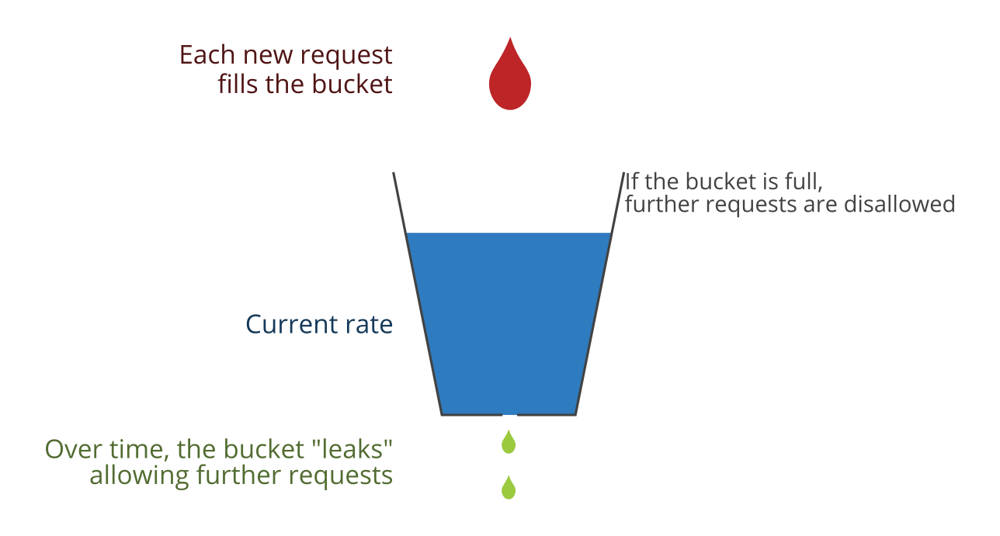

[Go back ](../README.md)
# Best practice prevent attack ddos? 

Ddos prevention is a difficult thing, because there are many types of ddos attacks and the most difficult thing is to
distinguish ddos requests from normal requests. I recommend using a 3rd party service for this, for
example: https://www.cloudflare.com/learning/ddos/what-is-a-ddos-attack/ , https://aws.amazon.
com/en/shield/ddos-attack-protection/  
I can recommend you the simplest way is to use DNS service rate limiter, cloud service. It is simple and quite useful in
protection from ddos attack. At least, it won't crash the system.

# Best practice in flash sales? 

Flash sale is a problem that many e-commerce products or e-commerce models encounter.  

Context:  
During the promotion, a very large number of users, tens or even hundreds of times larger than the system's load
capacity. The system is subjected to an excessive load and down. In this article, I will analyze how to make the system
work stably, demo with specific project, and more importantly analyze to show you the principle and essence of the
problem.  

Principle (made up by myself, I find it suitable for explanation)  

1) The principle of water flowing into the bucket:  
   There are n drops of water flowing into the bucket, when the number of drops is too large, the bucket will be full
   and overflow. This is similar to the load capacity of the system. The key point is that you have to know which bucket
   to use and which bucket to remove so that the system doesn't go down.  

2) Minimum condition principle:  
   A service usually has a minimum condition for it to work. I give an example with service inventory, the minimum
   condition is usually: As long as the system can withstand the pressure of deducting goods from the user's inventory,
   the system will still run stably.  

Applied to flash sales problem:  

1) The naive approach of rate limit:  
   I encountered a lot of cases, the system used its rate limit base on cache in system. This is a foolish thing. Flash
   sale in a certain corner is like ddos, using your system to handle falsh sale over ratelimit while your system can't
   do it is like bringing a small bucket out to catch a large amount of water. The system will down. So what is sotuion,
   use a 3rd party tool.  

What this 3rd party tool needs to ensure: only requests within the computational limit to the server, all over-rate
requests are handled at the 3rd party service, which means your system will never be overloaded. Remember, this doesn't
help customers make purchases faster, but it does keep the system up and running and not down. Even customers who can't
buy goods due to rate limit, they also get fast results processed by 3rd parties. Here the bucket of water was collected
by a third party. Don't use a bucket if your bucket is too small.  

The 3rd party that does a good job of catching water with buckets can say: rate limit Cloudflare, rate limit apiGateway
AWS, rate limit WAF AWS,... It can be any party if it meets the conditions I have specified. accumulate. Specifically I
have a repo to verify this:  

2) Minimum condition principle:  
   This is related to the specific project, I do not mention here. This principle helps you to find the system's key
   service, it is the bottleneck of the system. This helps you calculate the exact rate limit number.  

[Go back ](../README.md)