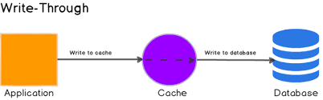
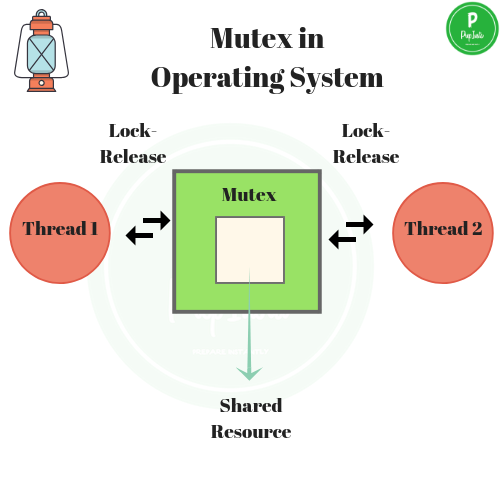
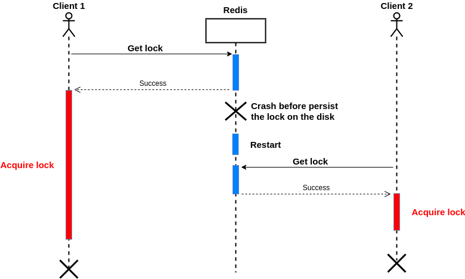
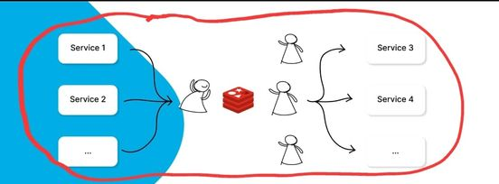

[Go back ](../README.md)
## Cache <a name="cache"></a>

## What is cache? <a name="what_is_cache"></a>


</br> For web apps, the cache backend is a stored memory that represents a certain data of the system. Don't depend on
the figure next to it, it's simply a memory area, which can be independent or dependent on the database (it doesn't
matter)

## What is cache importance in webapp? <a name="why_is_cache_importance_in_web_app"></a>

Unlike about ten years ago, today's webapp is growing and there are many problems arising: number of users, traffic,
storage io limit. All of them are many times over from the early days of the web. Cache is an integral part of today's
web apps to solve these problems. </br>

## What is cache in Laravel? <a name="what_is_cache_in_laravel"></a>

Cache Laravel is like defining cache, an area of memory that serves storage. Cache Laravel is developed independently of
the php cache and is a very successful tool that effectively serves developers.

## What is type of cache in Laravel? <a name="what_is_type_of_cache_in_laravel"></a>

Laravel supports popular caching backends like Memcached, Redis, DynamoDB, and relational databases out of the box,
file.

## Best practice when use driver cache? <a name="best_practice_when_use_driver_cache"></a>

This is true for Laravel as well as other web app environments:

1) In large web app applications, you should use redis, memcahed or same... In these big applications, performance,
   stability are very important factors. Driver redis, memcache,... used by all big products and recommended. </br>

2) If your project is small, there are no strict performance requirements, you can use driver file, DB... This is a
   general recommendation because it depends on your system context infra. These are solutions that offer slow
   performance but don't worry, as long as it meets your problem, it should be good enough to use. </br>

## Contracts cache? <a name="contracts_cache"></a>

In https://github.com/laravel/framework/blob/7.x/src/Illuminate/Contracts/Cache/Repository.php , Laravel define
interface for common manipulation with cache: pull, put, add, get , set, delete... Repository is the part that interacts
directly with the drive cache. </br>

In https://github.com/laravel/framework/blob/7.x/src/Illuminate/Contracts/Cache/Factory.php , Laravel define interface
store() returns the Repository's instance by name. </br>

In https://github.com/laravel/framework/blob/7.x/src/Illuminate/Contracts/Cache/Lock.php, Laravel define interface for
mutex lock, basic operations with a mutex: get, block, set, release, forceRelease. </br>

## Dissect cache <a name="dissect_cache"></a>

## How to Repository cache in Laravel work? <a name="how_to_repository_cache_in_laravel_work"></a>

In https://github.com/laravel/framework/blob/7.x/src/Illuminate/Contracts/Cache/Repository.php , Laravel defines one
repo for all drive cache,
it agrees on a common standard for drive caches.

## How is Laravel get value of one key? <a name="how_is_laravel_get_value_of_one_key"></a>

``` 
      /**
      * Retrieve an item from the cache by key.
      *
      * @param string $key
      * @param mixed $default
      * @return mixed
      */
      public function get($key, $default = null)
      {
      if (is_array($key)) {
      return $this->many($key);
      }

        $value = $this->store->get($this->itemKey($key));

        // If we could not find the cache value, we will fire the missed event and get
        // the default value for this cache value. This default could be a callback
        // so we will execute the value function which will resolve it if needed.
        if (is_null($value)) {
            $this->event(new CacheMissed($key));

            $value = value($default);
        } else {
            $this->event(new CacheHit($key, $value));
        }

        return $value;
    }

    /**
     * Retrieve multiple items from the cache by key.
     *
     * Items not found in the cache will have a null value.
     *
     * @param array $keys
     * @return array
     */
    public function many(array $keys)
    {
        $values = $this->store->many(collect($keys)->map(function ($value, $key) {
            return is_string($key) ? $key : $value;
        })->values()->all());

        return collect($values)->map(function ($value, $key) use ($keys) {
            return $this->handleManyResult($keys, $key, $value);
        })->all();
    }


    /**
    * Fire an event for this cache instance.
    *
    * @param string $event
    * @return void
    */
    protected function event($event)
    {
      if (isset($this->events)) {
        $this->events->dispatch($event);
      }
    }

    /**
     * Fire an event for this cache instance.
     *
     * @param string $event
     * @return void
     */
    protected function event($event)
    {
        if (isset($this->events)) {
            $this->events->dispatch($event);
        }
    }

``` 

First, Laravel gets the config cache information to return the instance value: $this->store. $this->store represents the
drive cache that the system is using at the moment. Next, Laravel deteach to run get many or get one, Laravel relies on
the corresponding drive cache to parse the appropriate command. The commands are defined in each cache driver:
RedisStore.php, MemcachedStore.php, DatabaseStore.php, ArrayStore.php. Commands are navigated by laravel to specific
infra and return results. Details how Laravel parser and handle command redis driver: </br>

``` 
    /**
     * Returns the value of the given key.
     *
     * @param string $key
     * @return string|null
     */
    public function get($key)
    {
        $result = $this->command('get', [$key]);

        return $result !== false ? $result : null;
    }


    /**
     * Run a command against the Redis database.
     *
     * @param string $method
     * @param array $parameters
     * @return mixed
     */
    public function command($method, array $parameters = [])
    {
        $start = microtime(true);

        $result = $this->client->{$method}(...$parameters);

        $time = round((microtime(true) - $start) * 1000, 2);

        if (isset($this->events)) {
            $this->event(new CommandExecuted($method, $parameters, $time, $this));
        }

        return $result;
    }
``` 

$result = $this->client->{$method}(...$parameters); Laravel parser command to Lua Scripts and executes it. </br>

## How is Laravel push value to one key? <a name="how_is_laravel_push_value_to_one_key"></a>

```
/**
      * Store an item in the cache.
      *
      * @param string $key
      * @param mixed $value
      * @param \DateTimeInterface|\DateInterval|int|null $ttl
      * @return bool
      */
     public function put($key, $value, $ttl = null)
     {
         if (is_array($key)) {
             return $this->putMany($key, $value);
         }

         if ($ttl === null) {
             return $this->forever($key, $value);
         }

         $seconds = $this->getSeconds($ttl);

         if ($seconds <= 0) {
             return $this->forget($key);
         }

         $result = $this->store->put($this->itemKey($key), $value, $seconds);

         if ($result) {
             $this->event(new KeyWritten($key, $value, $seconds));
         }

         return $result;
     }
```

==> same as get(), layout classes will be like, get $this->store from config, from type push convert to script of drives
cache, finally fire the event and return.

## How to Laravel implement one instance cache? <a name="how_to_laravel_implement_one_instance_cache"></a>

For each drive, Laravel implements 2 classes, 1 class for Store and query, 1 class for locking. For example with redis
drive, it is: RedisStore.php and RedisLock.php.
In https://github.com/laravel/framework/blob/7.x/src/Illuminate/Cache/RedisStore.php
</br> Laravel implements all the methods for the interfaces mentioned in the previous section. The main thing is parser
command to script and excute. Mapping with the previous section, if you configure drive cache is Redis, one instance of
RedisStore will be passed by Laravel to $this->store in Repository.php. Now you also understand why Laravel named
Repository.php, it design pattern repository, $kernel of Laravel will act as a factory that reads the config cache and
binds the appropriate instance to Cache/Repository.php

## How to Laravel implement one endpoint call Cache from CacheManager? <a name="how_to_laravel_implement_one_endpoint_call_cache_from_cache_manager"></a>

## How to Facades Cache bind and what bind? <a name="how_to_facades_cache_bind_and_what_bind"></a>

Print https://github.com/laravel/framework/blob/7.x/src/Illuminate/Foundation/Application.php#L1241

```
'cache' => [\Illuminate\Cache\CacheManager::class, \Illuminate\Contracts\Cache\Factory::class],
```

Laravel binding facades 'cache' to \Illuminate\Cache\CacheManager::class and implement
\Illuminate\Contracts\Cache\Factory::class.

## How to CacheManager mapping to one driver cache? <a name="how_to_cache_manager_mapping_to_one_driver_cache"></a>

In https://github.com/laravel/framework/blob/7.x/src/Illuminate/Cache/CacheManager.php

```
    /**
     * Attempt to get the store from the local cache.
     *
     * @param string $name
     * @return \Illuminate\Contracts\Cache\Repository
     */
    protected function get($name)
    {
        return $this->stores[$name] ?? $this->resolve($name);
    }


    /**
     * Resolve the given store.
     *
     * @param string $name
     * @return \Illuminate\Contracts\Cache\Repository
     *
     * @throws \InvalidArgumentException
     */
    protected function resolve($name)
    {
        $config = $this->getConfig($name);

        if (is_null($config)) {
            throw new InvalidArgumentException("Cache store [{$name}] is not defined.");
        }

        if (isset($this->customCreators[$config['driver']])) {
            return $this->callCustomCreator($config);
        } else {
            $driverMethod = 'create'.ucfirst($config['driver']).'Driver';

            if (method_exists($this, $driverMethod)) {
                return $this->{$driverMethod}($config);
            } else {
                throw new InvalidArgumentException("Driver [{$config['driver']}] is not supported.");
            }
        }
    }


    /**
     * Get a cache store instance by name, wrapped in a repository.
     *
     * @param string|null $name
     * @return \Illuminate\Contracts\Cache\Repository
     */
    public function store($name = null)
    {
        $name = $name ?: $this->getDefaultDriver();

        return $this->stores[$name] = $this->get($name);
    }

```

==> This is the endpoint of the cache in laravel core, store() get the corresponding drive instance configured and
returned \Illuminate\Contracts\Cache\Repository. This repository has been analyzed very carefully in the previous
section. The class takes \Illuminate\Contracts\Foundation\Application and uses it throughout the class.
Foundation\Application is the full object of components binding in Laravel's core.

## Call static auto mapping in CacheManager?  <a name="call_static_auto_mapping_in_cache_manager"></a>

```
/**
      * Dynamically call the default driver instance.
      *
      * @param string $method
      * @param array $parameters
      * @return mixed
      */
     public function __call($method, $parameters)
     {
         return $this->store()->$method(...$parameters);
     }
```

You already know Laravel uses a lot of magic methods, typically Facades with __call . In CacheManager, Laravel
implements dynamically call the default driver instance. Methods of type Cache::get(), Cache::put(),... will pass
through 2 layers of __call, 1 is __call to solve Facade ==> CacheManager, 2 is __call() to resolve method of cache to
endpoint from autoloadind: return $ this->store()->$method(...$parameters); </br>

Many argue that Laravel is abusing calling static. Maybe, i'm not sure. But in Laravel, the php magic method is used
very cleverly and seems to be on the level of art.

## What is mutex lock?  <a name="what_is_muxtex_lock"></a>



Mutex lock is a mechanism to share resources in shared resources. Regardless of the context, the mutex must always have
a synchronous step, which is used to control race conditions.

## How is mutex lock implement for many driver in Laravel?  <a name="how_is_mutex_lock_implement_for_many_driver_in_laravel"></a>

The implementation mechanism is the same as store data to cache. The endpoints in the Laravel driver are the same as for
store and query: RedisLock.php,
MemcachedLock.php, DatabaseLock.php ... Each driver will implement one lock for that driver.

## Dissect mutex lock in redis?  <a name="dissect_mutex_lock_in_redis"></a>

## How to algorithm of redis implement mutex lock? <a name="how_to_redis_implement_mutex_lock"></a>


Doc redis said it quite clearly, I would like to quote and explain more:

Before trying to overcome the limitation of the single instance setup described above, let's check how to do it
correctly in this simple case, since this is actually a viable solution in applications where a race condition from time
to time is acceptable, and because locking into a single instance is the foundation we'll use for the distributed
algorithm described here.

To acquire the lock, the way to go is the following:

```
    SET resource_name my_random_value NX PX 30000
```

The command will set the key only if it does not already exist (NX option), with an expire of 30000 milliseconds (PX
option). The key is set to a value “my_random_value”. This value must be unique across all clients and all lock
requests.

Basically the random value is used in order to release the lock in a safe way, with a script that tells Redis: remove
the key only if it exists and the value stored at the key is exactly the one I expect to be. This is accomplished by the
following Lua script:

```
if redis.call("get",KEYS[1]) == ARGV[1] then
    return redis.call("del",KEYS[1])
else
    return 0
end
```

This is important in order to avoid removing a lock that was created by another client. For example a client may acquire
the lock, get blocked performing some operation for longer than the lock validity time (the time at which the key will
expire), and later remove the lock, that was already acquired by some other client. Using just DEL is not safe as a
client may remove another client's lock. With the above script instead every lock is “signed” with a random string, so
the lock will be removed only if it is still the one that was set by the client trying to remove it.

What should this random string be? We assume it's 20 bytes from /dev/urandom, but you can find cheaper ways to make it
unique enough for your tasks. For example a safe pick is to seed RC4 with /dev/urandom, and generate a pseudo random
stream from that. A simpler solution is to use a UNIX timestamp with microsecond precision, concatenating the timestamp
with a client ID. It is not as safe, but probably sufficient for most environments.

The "lock validity time" is the time we use as the key's time to live. It is both the auto release time, and the time
the client has in order to perform the operation required before another client may be able to acquire the lock
exclusion again, without technically violating the mutual guarantee, which is only limited to a given window of time
from the moment the lock is acquired.

So now we have a good way to acquire and release the lock. With this system, reasoning about a non-distributed system
composed of a single, always available, instance, is safe. Let's extend the concept to a distributed system where we
don't have such guarantee.

============================================================================================================================================================================================================================

==> Oh, it's quite long, I'll paraphrase it briefly.. With singel instance redis, the problem is relatively simple:

```
 SET resource_name my_random_value NX PX 30000 
```

is the sync I mentioned in the previous section. This synchronization is implemented in core Redis, it only allows one
key to exist and never overwrites the key. </br?

```
if redis.call("get",KEYS[1]) == ARGV[1] then
    return redis.call("del",KEYS[1])
else
    return 0
end
```

ARGV[1] is randomly generated so it is the security of the function. Someone whose value of KEYS[1] matches ARGV[1] is
the owner of the lock, otherwise it is invalid. </br>

==>> with one instance redis, muxtex lock implementation is simple and without many problems.

## What is distribute lock? <a name="what_is_distribute_lock"></a>


Distribute lock is a distributed lock system plus verify lock consensus mechanism for the purpose of increasing system's
lock tolerance

## What is redlock?  <a name="./modules/cache.md#what_is_redlock"></a>

Redlock is a distributed locking system on redis. Specifically the Redlock algorithm is
implemented: http://antirez.com/news/77.
A few libraries that implement redock: https://github.com/amyangfei/redlock-go...

## How to Laravel implement theory of Redis?  <a name="how_to_laravel_implement_theory_of_redis"></a>

## How to Laravel implement set mutex from Lua scripts?  <a name="how_to_laravel_implement_set_lua_scripts"></a>

In Abstract class: https://github.com/laravel/framework/blob/7.x/src/Illuminate/Cache/Lock.php , Laravel implements an
abstract class for every drive lock to follow:

```
    /**
     * Attempt to acquire the lock.
     *
     * @param callable|null $callback
     * @return mixed
     */
    public function get($callback = null)
    {
        $result = $this->acquire();

        if ($result && is_callable($callback)) {
            try {
                return $callback();
            } finally {
                $this->release();
            }
        }

        return $result;
    }


    /**
     * Attempt to acquire the lock.
     *
     * @return bool
     */
    abstract public function acquire();
```

Laravel implements a public function get(), which takes the appropriate abstract fc acquire() for each cache driver. If
you pass in a callback fc in callback, it will run the callback action and release the lock. If the callback is not
passed, it will return a bool corresponding to whether the key was obtained or not. </br>

How a key is implemented, let's dissect the example with redis. Print

```
 /**
     * Attempt to acquire the lock.
     *
     * @return bool
     */
    public function acquire()
    {
        if ($this->seconds > 0) {
            return $this->redis->set($this->name, $this->owner, 'EX', $this->seconds, 'NX') == true;
        } else {
            return $this->redis->setnx($this->name, $this->owner) === 1;
        }
    }

// how to get $owner:
    /**
     * Create a new lock instance.
     *
     * @param string $name
     * @param int $seconds
     * @param string|null $owner
     * @return void
     */
    public function __construct($name, $seconds, $owner = null)
    {
        if (is_null($owner)) {
            $owner = Str::random();
        }

        $this->name = $name;
        $this->owner = $owner;
        $this->seconds = $seconds;
    }
```

Simply, as demonstrated in #HowToRedisImplementMutexLock, Laravel run Lua script: </br>

```
 SET resource_name my_random_value NX PX time_expiry
```

resource_name is $this->name, my_random_value, my_random_value is $this->owner.

## How to Laravel implement release mutex form Lua scripts?  <a name="how_to_laravel_implement_set_lua_scripts"></a>

Print Abstract class: https://github.com/laravel/framework/blob/7.x/src/Illuminate/Cache/Lock.php

```
   
    /**
     * Release the lock.
     *
     * @return bool
     */
    abstract public function release();


// print RedisLock.php

    /**
     * Release the lock.
     *
     * @return bool
     */
    public function release()
    {
        return (bool) $this->redis->eval(LuaScripts::releaseLock(), 1, $this->name, $this->owner);
    }


// print Luascripts:
  /**
     * Get the Lua script to atomically release a lock.
     *
     * KEYS[1] - The name of the lock
     * ARGV[1] - The owner key of the lock instance trying to release it
     *
     * @return string
     */
    public static function releaseLock()
    {
        return <<<'LUA'
if redis.call("get",KEYS[1]) == ARGV[1] then
    return redis.call("del",KEYS[1])
else
    return 0
end
LUA;
    }

```

Simply, as demonstrated in #HowToRedisImplementMutexLock, Laravel implements Lua:

```
if redis.call("get",KEYS[1]) == ARGV[1] then
    return redis.call("del",KEYS[1])
else
    return 0
end
```

As mentioned, this is an authen and verify step, only the owner of the key has the right to release the key, or have to
wait until invalidate cache.  </br>

## Advantages and disadvantages of mutex lock redis?  <a name="advantages_and_disadvantages_of_mutex_lock_redis"></a>

+) Advantages: </br>
High performance: </br>
This is one of the fastest shared lock systems, with medium servers, redis can handle hundreds of thousands of qps race
conditions get lock mutex. This is a huge number for most products.
+) Disadvantages: </br>
Integrity: </br>
Redis is not a database for integrity, it is for performance. There is an option for data integrity but it no longer
plays on the speed power of redis. If you use redis mutex lock for updating database inventory, update balance amount in
DB, if you handle redis poorly, redis crash can lead to lost key locks, leading to data confusion. This never happens if
you use locks and transactions at the database layer.

# What is local in memory? <a name="what_is_local_in_memory"></a>



In webapp, you are already familiar with a remote cache. Local in memory is a cache service similar to remote cache but
implemented in local server run service, it has very high speed because it ignores network time. Simply put, in the same
server you deploy backend service, you deploy a local cache on that same server to get the highest speed by ignoring
network time.

# What is type of local in memory? <a name="what_is_type_of_local_in_memory"></a>

This depends on the language:

1) Languages have shared memory between processes: (golang, c, c++,...), they often local memory is part of the variable
   in that language. Lock and sync mechanisms are used for handling race conditions

2) Language does not share memory between processes (php), they often implement 3rd party service cache on the same
   server as the running service. This method is less efficient than method 1.

# When is use local in memory? <a name="when_is_use_local_in_memory"></a>

Use cases: </br>
Data is repetitive, requires extremely low latency and the frequency of data changes is not large. Usually data config,
data setup, data is quite large but very limited to change.

# Implement local in memory with Laravel? <a name="implement_local_in_memory_with_laravel"></a>

Php is a language without shared memory. The common implementation is to use a 3rd party service cache. Specifically,
with docker, you have 2 backend images and redis images, you deploy it in docker compose, each server run image deploys
those 2 services.
To update the new value, you need an event driven to update the data accordingly.


# Advantages and disadvantages of local in memory with Laravel? <a name="advantages_and_disadvantages_of_local_in_memory_with_laravel"></a>

Advantages: </br>
Get the highest speed, many times higher with cache remote. </br>
Cons: </br>

1) Resource consuming, each instance will have to take resources to run an additional local cache service. </br>
2) Deploying and invalidating variables with event drive is not easy with uninvested products. </br>

[Go back ](../README.md)