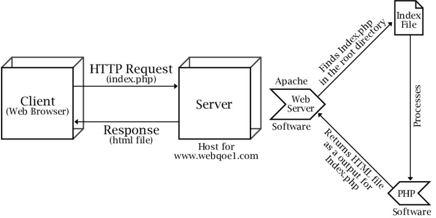
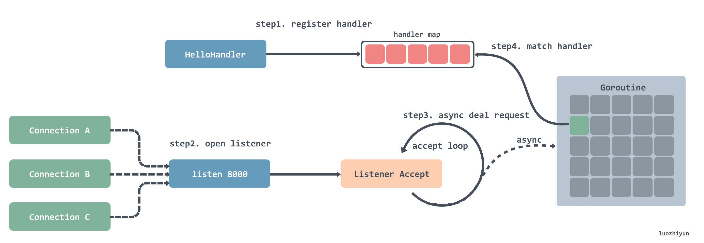
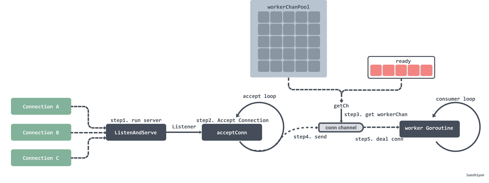
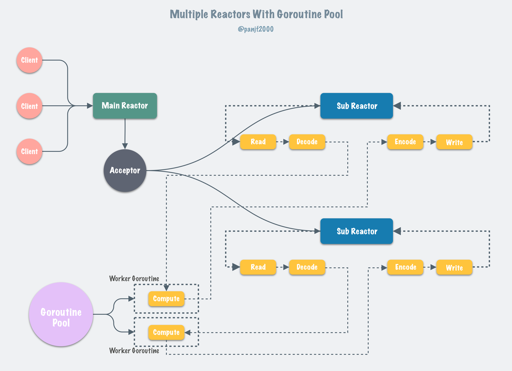

[Go back ](../README.md)
## Http and Routing <a name="http_and_routing"></a>

## Preview type Http server <a name="preview_type_http_server"></a>

1) Independent webserver: </br>
   
   This is the classic model of the traditional webserver and is still commonly used for most interpreted languages
   today. You have a WebServer completely independent of the language, with each request to the server, the WebServer
   listens to the signal and request information from the OS, the WebServer generates a process to handle the request.
   Process finds the root folder of the language, finds the endpoint run process (with php usually index.php). Index.php
   mapping request with handle function and response. </br>
   Today, this model is inferior to the new models because of some inherent weaknesses, the process is required to run
   on the OS, the cost switch context WebServer and Script is relatively high, the size of one process handle request is
   often large. </br>

2) WebServer integrated with platform: </br>

WebServers are integrated with the language's technology, achieving very high performance and suitability for that
language. This mechanism is most common in compiled languages. Let's examine the example with golang:

1) net/http server:
   
    1) registering the processor into a hash table, which can be matched by key-value routing. </br>
    2) after registration, a loop is opened to listen, and a Goroutine is created every time a connection is listening
       to. </br>
    3) the created Goroutine will wait in a loop to receive the request data, then match the processor with the request
       address in the processor routing table and pass the request to the processor for processing. </br>

==> This model gives great performance because each Goroutine handle request is about 2 to 8 KB in size, can create a
huge concurrency threshold with the same number of servers to handle the request. </br>

2) fast http golang:
   
    1) initiating a listen. </br>
    2) listen to the port in a loop to get a connection. </br>
    3) first fetch the workerChan from the ready queue when it gets a connection, and then fetch it from the object pool
       if it doesn't. </br>
    4) pass the listening connection into the workerChan's channel. </br>
    5) the workerChan has a Goroutine that loops through the data in the channel, and when it gets it, it processes the
       request and returns it. </br>
       ===> this model has ten times better performance than net/http at high load because of using worker pool
       advantage, no reInit worker cost. </br>


3) gnet golang:
   
   ==> this is a model with performance close to Haproxy, the key is non blocking form epoll and pool worker, ring
   buffer </br>

## What is trending in Http server? <a name="what_is_trending_in_http_server"></a>

For performance, trending is WebServer integrated with platform. But, in terms of popularity, the Independent webserver
model is more popular. </br>

## Type http server in Php and Laravel. <a name="TypeHttpServerInPhpAndLaravel"></a>

Php has webserver types according to both models above, but the most popular model is 1: Independent webserver. The same
is true for Laravel </br>

## Why  are there so many webserver models? <a name="why_are_there_so_many_webserver_models?"></a>

There are many languages and backend approaches, each of which needs to have some appropriate webserver model. </br>

## Preview contracts in http modules <a name="preview_contracts_in_http_modules"></a>

In https://github.com/laravel/framework/blob/7.x/src/Illuminate/Contracts/Routing/Registrar.php , laravel defines the
related interfaces that register a common http method: GET, POST, PUSH, OPTION </br>

In https://github.com/laravel/framework/blob/7.x/src/Illuminate/Contracts/Routing/BindingRegistrar.php, Laravel defines
the interface for binding a router. </br>

In https://github.com/laravel/framework/blob/7.x/src/Illuminate/Contracts/Http/Kernel.php, Laravel defines interface for
Bootstrap http request to kernel, defines endpoint handle() for handling all http requests </br>

## Why is the webServer model constantly changing? <a name="why_is_the_web_server_model_constantly_changing?"></a>

Languages and technologies change constantly, so do web servers. But keep in mind that the ultimate goal of webserver
improvement is usually to increase more than the amount of rps that can be handled in a server. </br>

## Dissect http and routing modules <a name="dissect_http_and_routing_modules"></a>

## How to register one router work? <a name="how_to_register_one_router_work?"></a>

In https://github.com/laravel/framework/blob/7.x/src/Illuminate/Routing/Router.php, preview one router get: </br>

``` 
/**
* Register a new GET route with the router.
*
* @param string $uri
* @param array|string|callable|null $action
* @return \Illuminate\Routing\Route
*/
public function get($uri, $action = null)
{
    return $this->addRoute(['GET', 'HEAD'], $uri, $action);
}
``` 

When you register a router, laravel will save the router information and action handle it. Dig deep into the function,
you will see:

``` 
/**
* Add a Route instance to the collection.
*
* @param \Illuminate\Routing\Route $route
* @return \Illuminate\Routing\Route
*/
public function add(Route $route)
{
    $this->addToCollections($route);

        $this->addLookups($route);

        return $route;
    }

    /**
     * Add the given route to the arrays of routes.
     *
     * @param \Illuminate\Routing\Route $route
     * @return void
     */
    protected function addToCollections($route)
    {
        $domainAndUri = $route->getDomain().$route->uri();

        foreach ($route->methods() as $method) {
            $this->routes[$method][$domainAndUri] = $route;
        }

        $this->allRoutes[$method.$domainAndUri] = $route;
    }

``` 

=) in class namespace Illuminate\Routing\Route, laravel fully defines a router's method, including route information,
action handle request to be encode and parser specifically:

``` 
/**
* Parse the given action into an array.
*
* @param string $uri
* @param mixed $action
* @return array
*/
public static function parse($uri, $action)
{
    // If no action is passed in right away, we assume the user will make use of
    // fluent routing. In that case, we set a default closure, to be executed
    // if the user never explicitly sets an action to handle the given uri.
    if (is_null($action)) {
    return static::missingAction($uri);
    }

    // If the action is already a Closure instance, we will just set that instance
    // as the "uses" property, because there is nothing else we need to do when
    // it is available. Otherwise we will need to find it in the action list.
    if (is_callable($action, true)) {
        return ! is_array($action) ? ['uses' => $action] : [
            'uses' => $action[0].'@'.$action[1],
            'controller' => $action[0].'@'.$action[1],
        ];
    }

    // If no "uses" property has been set, we will dig through the array to find a
    // Close instance within this list. We will set the first Closure we come
    // across into the "uses" property that will get fired off by this route.
    elseif (! isset($action['uses'])) {
        $action['uses'] = static::findCallable($action);
    }

    if (is_string($action['uses']) && ! Str::contains($action['uses'], '@')) {
        $action['uses'] = static::makeInvokable($action['uses']);
    }

    return $action;
    }

``` 

+) when registering a router in the code file (web.php), laravel parses the router into an object of
Illuminate\Routing\Route, the object is stored in an array and will be checked to get the necessary information when
there is an incoming request server:

``` 
// in fc protected function addToCollections($route)
foreach ($route->methods() as $method) {
    $this->routes[$method][$domainAndUri] = $route;
}
``` 

## How to mapping request to server with router? <a name="how_to_mapping_request_to_server_with_route?"></a>

Simply put, laravel aggregates all the routes you subscribe to in an array (specifically in the previous section). Each
request to the webserver, laravel parses request information and maping with array saved all router. </br>

## Laravel handle all request with one endpoint <a name="laravel_handle_all_request_with_one_endpoint"></a>

source index.php:

``` 
$kernel = $app->make(Illuminate\Contracts\Http\Kernel::class);

$response = $kernel->handle(
$request = Illuminate\Http\Request::capture()
);

$response->send();

$kernel->terminate($request, $response);
``` 

inside class Kernel: https://github.com/laravel/framework/blob/7.x/src/Illuminate/Foundation/Http/Kernel.php <br>

``` 
/**
* Handle an incoming HTTP request.
*
* @param \Illuminate\Http\Request $request
* @return \Illuminate\Http\Response
*/
public function handle($request)
{
try {
        $request->enableHttpMethodParameterOverride();

        $response = $this->sendRequestThroughRouter($request);
     } catch (Throwable $e) {
            $this->reportException($e);

            $response = $this->renderException($request, $e);
        }

        $this->app['events']->dispatch(
            new RequestHandle($request, $response)
        );

        return $response;
    }

    /**
     * Send the given request through the middleware/router.
     *
     * @param \Illuminate\Http\Request $request
     * @return \Illuminate\Http\Response
     */
    protected function sendRequestThroughRouter($request)
    {
        $this->app->instance('request', $request);

        Facade::clearResolvedInstance('request');

        $this->bootstrap();

        return (new Pipeline($this->app))
                    ->send($request)
                    ->through($this->app->shouldSkipMiddleware() ? [] : $this->middleware)
                    ->then($this->dispatchToRouter());
    }
``` 

==> Laravel creates $kernel endpoint, all incoming requests will be handled at public function handle($request). This
process includes many processes, but the most basic will be: find the corresponding callback acti, run the action
callback, dispatch the corresponding events to be registered and handle http exception.


[Go back ](../README.md)