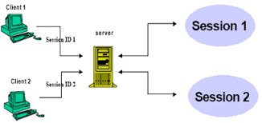
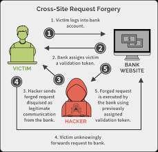
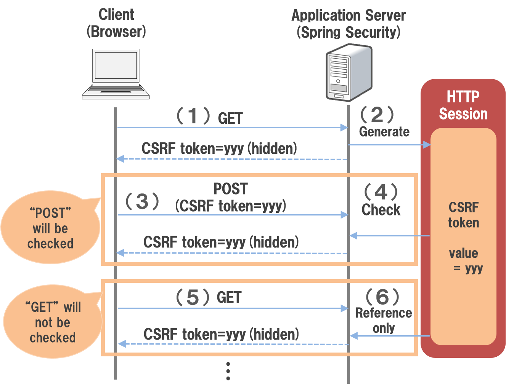
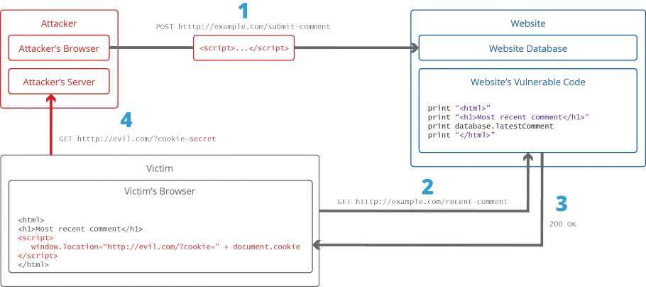
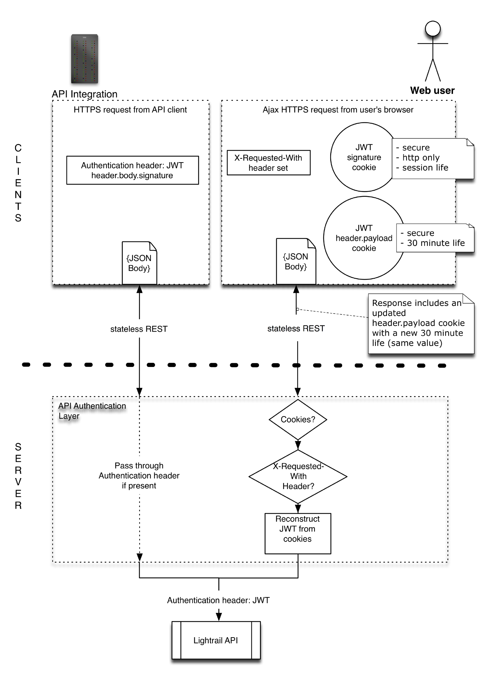

[Go back ](../README.md)

## Session <a name="session"></a>

## Define session  <a name="define_session"></a>



session = session_id + data mapping;  </br>

Simply put, a session is a memory area that is directly mapped to the user upon login. With any memory area, when using
it, it is necessary to identify (session_id) and data (data mapping). sesson_id is unique.

## Session in current web app <a name="session_in_current_web_app"></a>

In the modern world of web apps, especially microservices, it is not necessary to need a memory area that holds all the
data when the user logs in. Data in microservices directly depends on services and events, tending to be independent and
staless. However, when there is a need and need to use, or use any model like session, apply this simple rule: session =
session_id + data mapping; </br>

Session in web apps these days can use a lot of drivers, files, caches, DBs, cookies, etc. This is flexible and suitable
for today's needs.

## Session default in php is not good  <a name="default_ss_php_not_good"></a>

Session default in php not good enough? Exactly, it's not good enough for most web apps these days. Php auto generate
session Id and save in cookie, drive of this default is file. There is almost no way to interfere with this process.
This is obviously not good enough, use Laravel's session, it's a trend as most php frameworks are no longer using php's
default session. Other frameworks Django, Flask, Gin, ... have different approaches to sessions but the basic idea is
still the same general formula in the Session definition.

## Session in laravel <a name="session_in_laravel"></a>

## Preview session in laravel <a name="preview_session_in_laravel"></a>

Laravel Session is built by Laravel itself, completely independent of default php session. It fully supports all popular
drives: cache (redis/memcache, file, DB, cookie, ...). In a modern web application that needs high performance, I
recommend drive cache(redis/memcache).

## Dissect session in laravel  <a name="dissect_session_in_laravel"></a>

### Concat session <a name="concat_session"></a>

Session has many drives, the main operations with memory are read and write, so it is easy to guess the main interface
is read(), write(), getDefaultDriver() </br>

In line https://github.com/laravel/framework/blob/7.x/src/Illuminate/Support/Manager.php#L66 :

```
/**
* Get the default driver name.
*
* @return string
*/
abstract public function getDefaultDriver();

```

Session Manager extern Manager.php and it implements the function getDefaultDriver() to determine the driver configured
in the system. </br>

Print file: https://github.com/laravel/framework/blob/7.x/src/Illuminate/Contracts/Session/Session.php. It saves all
interfaces for session interaction, including push(), get().

### Detail session <a name="detail_session"></a>

``` 
/**
* Register the session manager instance.
*
* @return void
*/
protected function registerSessionManager()
{
  $this->app->singleton('session', function ($app) {
  return new SessionManager($app);
});
}
``` 

From snippet: https://github.com/laravel/framework/blob/7.x/src/Illuminate/Session/SessionServiceProvider.php#L34-L39.
Laravel registers a SessionManager() instance representing the laravel session.
in SessionMager, Laravel implements abstract public function getDefaultDriver()
using https://github.com/laravel/framework/blob/7.x/src/Illuminate/Session/SessionManager.php#L240-L243. It implements
the interface and returns the instance of the session drive configured in the system. </br>

How to laravel implement all driver and wrap it in code. After getting instance for session config in system, Laravel
pass instance to :
https://github.com/laravel/framework/blob/7.x/src/Illuminate/Session/Store.php#L57-L62

```
public function __construct($name, SessionHandlerInterface $handler, $id = null)
{
  $this->setId($id);
  $this->name = $name;
  $this->handler = $handler;
}
```

The SessionHandlerInterface represents one of the drives that Laravel has. The rest of the functions of the Store.php
class are a wrapper for the SessionHandlerInterface. </br>

+) In drive: https://github.com/laravel/framework/blob/7.x/src/Illuminate/Session/CacheBasedSessionHandler.php, it
implements the most basic functions like get(), set(), distroy (). Session in laravel with any drive is saved to a
session key, this operation is quite simple. </br>

===> to summarize there are two class blocks, code block 1 gets the instance drive configured, Code block 2 implements
the functions of each drive, this is the main job of the Laravel session.

# Csrf <a name="csrf"></a>

## Csrf Security Define <a name="csrf_security_define"></a>



Csrf is define clear in link: https://creativegroundtech.com/what-is-cross-site-request-forgery-csrf/. CSRF attacks
explois the trust a Web application has in an authenticated user. </br>

In short, user after authen success, hacker trick user into interacting with a page, from, link, ... or anything form
other web. After this action, hackers often submit a form to the web they want to attack. Because action form user
authen, broswer forward cookie and data, then request is valid. Hackers look for loopholes to send requests that damage
users and websites.

## Prevention Csrf <a name="prevention_csrf"></a>

Prevention Csrf:
Starting from the CSRF definition, i have prevention way: </br>
+) Use Same Site Flag Cookie : cookie will only be sent from request originating from 1 domain, hacker attack but
request reject beacause fail authen. </br>

+) Crsf Token: will explain in next part </br>

+) Open mode check CORS : it's bad solution, why it changes very much business. It's just only good solution when web
wants open check CORS(not for prevention CSRF, for business) </br>

## Csrf Token Define <a name="crsf_token_defines"></a>



Detail process CRSF token in link: https://terasolunaorg.github.io/guideline/5.1.0.RELEASE/en/Security/CSRF.html </br>

I want to emphasize, the object of the csrf token is usually a post form. Why? It's the second protection mechanism
after the authen websie for CSRF attack. </br>
Ideal is : we create token for submit form, when submit form, if token match, we access, if not match, we reject. If
hacker pass authen base session or token use CSRF attack, hacker don't simple get CSRF token ==> hacker don't submit
form ==> don't have any attacks.

## Why don't use Csrf for GET method <a name="dont_use_csrf_for_get_method"></a>

Why don't use CSRF for GET method: </br>
In define api, GET method return data, not change resouce, it's not risk of attacks. Of course, you can use the CSRF
token for the Get method,so it's not necessary, always remember the theorem, security and complexity are usually
proportional.

## Csrf Token Laravel <a name="crsf_token_laravel"></a>

Laravel keep ideal Crsf when implement.
How to create sessions?
view code: https://github.com/laravel/framework/blob/7.x/src/Illuminate/Session/Store.php#L64-L78 </br>

``` 
/**
* Start the session, reading the data from a handler.
*
* @return bool
  */
  public function start()
  {
  $this->loadSession();

         if (! $this->has('_token')) {
             $this->regenerateToken();
         }

         return $this->started = true;
  }

``` 

Laravel construct CSRF token when first time start session.
if (! $this->has('_token')) {
$this->regenerateToken();
} </br>

when one requets incoming sever, laravel check CSRF token ('_token' ) exits, if not exits, Laravel create new CSRF
token.

View code:
https://github.com/laravel/framework/blob/7.x/src/Illuminate/Session/Store.php#L609-L617 <br>

``` 
    /**
     * Regenerate the CSRF token value.
     *
     * @return void
     */
    public function regenerateToken()
    {
        $this->put('_token', Str::random(40));
    } </br>
``` 

CSRF token in laravel create by randon str. It's simple way why token don't contain data insight. CSRF token only one
task, check macth CRSF token with form submit. </br>
+) How to Laravel save CSRF cookies?
View code :
https://github.com/laravel/framework/blob/7.x/src/Illuminate/Foundation/Http/Middleware/VerifyCsrfToken.php#L78-L82 </br>

``` 
    /**
     * Handle an incoming request.
     *
     * @param \Illuminate\Http\Request $request
     * @param \Closure $next
     * @return mixed
     *
     * @throws \Illuminate\Session\TokenMismatchException
     */
    public function handle($request, Closure $next)
    {
        if (
            $this->isReading($request) ||
            $this->runningUnitTests() ||
            $this->inExceptArray($request) ||
            $this->tokensMatch($request)
        ) {
            return tap($next($request), function ($response) use ($request) {
                if ($this->shouldAddXsrfTokenCookie()) {
                    $this->addCookieToResponse($request, $response);
                }
            });
        }

        throw new TokenMismatchException('CSRF token mismatch.');
    }
``` 

For every incoming request, Laravel check exit XSRF cookie, if not exits, Laravel create it.

+) How to Laravel verify CSRF token?
view
code: https://github.com/laravel/framework/blob/7.x/src/Illuminate/Foundation/Http/Middleware/VerifyCsrfToken.php#L130-L143 </br>

``` 
/**
* Determine if the session and input CSRF tokens match.
*
* @param \Illuminate\Http\Request $request
* @return bool
*/
protected function tokensMatch($request)
{
    $token = $this->getTokenFromRequest($request);

    return is_string($request->session()->token()) &&
           is_string($token) &&
           hash_equals($request->session()->token(), $token);
} 
``` 

print
code : https://github.com/laravel/framework/blob/7.x/src/Illuminate/Foundation/Http/Middleware/VerifyCsrfToken.php#L72-L77
, have many rule verify CSRF, but main rule, it is before. </br>
Simple way, Laravel just checks CSRF in session and CSRF in cookie(XSRF) is matching, hash_equals($request->session()->
token(), $token).

```
===> From Laravel source, you learned one rule for timing attack. When you compare token, don't use ===, please you hash_compare or function same in other language.</br>
===> Well done, you clearly how to Laravel implement CSRF token.
You have skill debug of hard bug related to CSRF, 419 page expiry. Have CSRF bug is difficult to find context, but if you clearly core Laravel CSRF, you ready debug all.
```

## Xss <a name="xss"></a>

## Xss Security Define <a name="xss_security_define"></a>



1) The attacker injects a payload into the website’s database by submitting a vulnerable form with malicious JavaScript
   content. </br>
2) The victim requests the web page from the web server. </br>
3) The web server serves the victim’s browser the page with attacker’s payload as part of the HTML body. </br>
4) The victim’s browser executes the malicious script contained in the HTML body. In this case, it sends the victim’s
   cookie to the attacker’s server.
5) The attacker now simply needs to extract the victim’s cookie when the HTTP request arrives at the server. </br>
6) The attacker can now use the victim’s stolen cookie for impersonation. </br>

```
In short, Xss attack from the trust a use has in a particular Web application.
```

## Prevention Xss <a name="prevention_xss"></a>

How to Prevent Xss: </br>
+) Filter resource Xss </br>
+) Http Cookies only </br>
+) SameSite Origin Cookies </br>
+) Open mode check CORS in backend(not good solution) </br>

## Best practice Xss <a name="best_practice_xss"></a>

In my way, best practice prevent Xss: </br>
+) Actively filter data Xss after save
+) Http Only cookies, Http Same Site Origin cookies

## Why are there many type token, accessToken, refreshToken, What is their main purpose? <a name="what_is_their_main_purpose_many_type_token"></a>

This is a question that has a lot of opinions and I really haven't found a convincing answer. This is why I had to go
answer it myself. The main reason is to increase security, reduce the disclosure of important information. </br>

Let me explain it with an example: </br>

You have 4 bills of 1$, 5$, 100$ and 500$. You need to circulate this coin for the system to work properly. Thieves can
stalk and steal money at any time. You will choose how to rotate to reduce risk the most. </br>

From the theory of statistical probability, there will be a very simple thought, rotate the small coin as many times as
possible, the large coin as few times as possible. This simple thinking will also apply to tokens. </br>

Imagine 1$ is OauthToken, 5$ is accessToken, 100$ is refreshToken, 500$ is user + pass + otp. You see, tokens are
clearly differentiated by token value, the rights you get from that token. Users will only use tokens that are suitable
for their needs, not too large tokens for too small needs. Never pass OAuth with : user + pass + otp, that's
stupid. </br>

==> Obviously, the differentiation and creation of many types of tokens have helped to use tokens in the right context,
have reduced the risk of leaking important information of the system, contributing to increasing the overall security.
Note that the probability of exposing a token it does not depend on the type of token, but on the frequency of use of
that token. Please use the right token for the right purpose. </br>

## Where save token in browser, what is best practice? <a name="where_save_token"></a>

Where to save tokens in browser? This is classic Q/A? </br>
There are countless answers and countless approaches. For me when approaching in the direction of security and
performance, it my way: </br>
+) token always save in cookie with http only, security, same site,... </br>
==> it is the best way for security, leading security organizations advise to do it. </br>

But, In Mode Http only, js don't get cookies. So, how to call ajax, ... or same tool to request to server. Please check
next part. </br>

## How do ajax,... work with Http only cookie <a name="ajax_http_only_cookie"></a>

This is problem: token (jwt token) default don't verify from cookie. Token is stateless, in app or end point, it is
usually passed to header. But in broswer, in part: #WhereSaveToken, i suggest token should be stored http only
cookie. </br>

How to pass jwt verify when js don't get cookies in http only mode? </br>

I find many solutions in internet, but most of them are not good enough or too complicated, too risky. The most commonly
found solutiton was: XMLHTTPresponse headers are giving the cookie. It's very bad ideal. </br>

Luckily, I find solution match with my solution, it's simples way but don't have risk, don't have down
performance: </br>
https://medium.com/lightrail/getting-token-authentication-right-in-a-stateless-single-page-application-57d0c6474e3 </br>



```
Simple way, leave that to the backend. All you need to do is create a middleware, middleware job is to check exist jwt in header, if not exits, it's auto copy jwt from cookie to header. If done, it's return and allow next handle. </br>
This solution work for all browser and all tool call api. Great !!!
```

## Why framework frontend often use local store for save token? <a name="why_framework_front_end_oftern_user_local_store_for_save_token"></a>

First, it is an unsafe way. As I have analyzed in the previous sections as well as all the leading security
organizations in the world recommend, save tokens in cookies.

So why does the frontend framework do that? The problem here is trade-off and convenience. They sacrifice security for
convenience. Specifically, if the token is stored in the local store, they do not need a solution backend for verifying
the token in the cookie, they will run their frame independently according to the token standard, they can easily get
the token and pass to ajax, fetch. They know it's less secure, but it's a trade-off. I see a lot of blocker explaining
that they store in the local store is secure enough, they are good people and they know what is secure,... It's all just
an excuse for the fact that the block writer doesn't understand deeply about it. Base yourself on the deepest theory,
not on the basis of the majority.

[Go back ](../README.md)